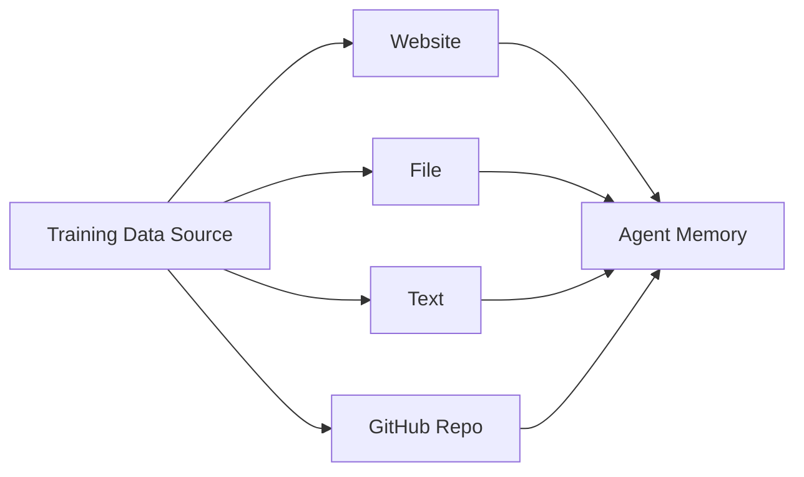
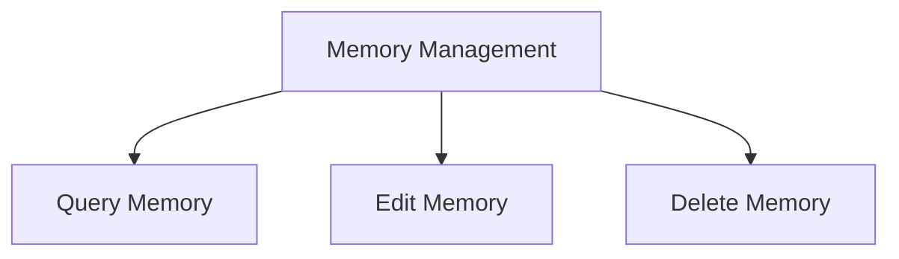
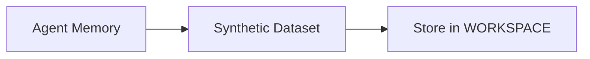

# Agent Training in Novix

Novix provides an advanced and flexible memory system that allows you to train agents on various types of data. This training process enables agents to interact intelligently with your data, answering queries based on the context they’ve learned.

## Training Modes

1. **Website Training**\
   To train an agent on a website, simply provide the website URL and initiate the training process. The agent will scrape the website’s content and store it in its long-term memory. This allows the agent to answer questions about the website's content.

```python


Novix.learn_from_website(agent_name="gpt4free", url="https://example.com")
```

2. **File Training**\
   Novix can train an agent using a variety of file types, including ZIP archives, plain text, PDFs, CSV, XLSX, and more. Upon uploading these files, the agent will parse and store the data into its memory, making it capable of answering questions based on the contents of the files.

```python


Novix.learn_from_file(agent_name="gpt4free", file_path="path/to/file.pdf")
```

3. **Text Training**\
   You can train the agent by providing any text and associating it with a relevant query. For example, you can associate a description like “AInovix's favorite color” with the text “Yellow.” This enables the agent to respond accurately to questions related to that context.

```python


Novix.learn_from_text(
    agent_name="gpt4free", 
    query="What is AInovix's favorite color?", 
    text="Yellow"
)
```

4. **GitHub Repository Training**\
   Novix can download all files from a specified GitHub repository and store them in its memory. This allows the agent to answer questions regarding the repository, including specific files or code within the repository. You can specify a branch or provide credentials for private repositories.

```python


Novix.learn_from_github_repo(
    agent_name="gpt4free",
    github_repo="AInovix/Novix",
    branch="main"
)
```



## Memory Management

On the Memory Management page, you can query the agent’s memory using search terms to retrieve relevant data. Each memory entry will have a relevance score, allowing you to manage, edit, or delete entries as needed.

```
•	Query Memory:python


Novix.query_memory(agent_name="gpt4free", query="AInovix's favorite color")
•	Delete Specific Memory:python


Novix.delete_memory(agent_name="gpt4free", memory_id="memory123")
```



## Synthetic Dataset Creation

Novix can convert its learned memories into a synthetic dataset formatted for various training strategies, such as DPO, CPO, or ORPO. These datasets can then be used to fine-tune models like ChatGPT or DeepSeek. The datasets are structured in a question/good answer/bad answer format for efficient training.

API Endpoint for Synthetic Dataset Creation:

```python

Novix.create_dataset(
    agent_name="gpt4free",
    dataset_name="synthetic_dataset",
    batch_size=5
)
```

The generated dataset will be stored at the following location:

```bash


Novix/Novix/WORKSPACE/{dataset_name}.json
```



## Model Training Based on Agent Memory

After training the agent on various data sources (e.g., GitHub repositories, websites, files), Novix provides an endpoint for further training. The agent’s memories are converted into a dataset, which can then be used to fine-tune models like ChatGPT or DeepSeek.

```
•	Training with Synthetic Dataset:
Novix can fine-tune models like ChatGPT or DeepSeek on the synthetic datasets created from the agent’s learned memories. The training process is streamlined, and the new model can be uploaded to HuggingFace upon completion.

```

```python
from Novixsdk import NovixSDK

Novix = NovixSDK(base_uri="http://localhost:7437", api_key="Your_Novix_API_Key")

agent_name = "gpt4free"
dataset_name = "synthetic_dataset"

# Learn from GitHub repository
Novix.learn_from_github_repo(
   agent_name=agent_name,
   github_repo="Josh-XT/Novix",
   collection_number="0"
)

# Create synthetic dataset
Novix.create_dataset(agent_name=agent_name, dataset_name=dataset_name, batch_size=5)

# Train model on the synthetic dataset
Novix.train(
   agent_name="gpt4free",
   dataset_name=dataset_name,
   model="unsloth/mistral-7b-v0.2",
   max_seq_length=16384,
   huggingface_output_path="JoshXT/finetuned-mistral-7b-v0.2",
   private_repo=True
)
```

**Fine-Tuning the Model**\
The training can be done on various model architectures, such as DPO QLoRA using unsloth, for models like ChatGPT or DeepSeek, and the new model can be uploaded to HuggingFace for deployment or further fine-tuning.

**Example for fine-tuning:**

```python


Novix.train(
    agent_name="gpt4free",
    dataset_name="synthetic_dataset",
    model="unsloth/mistral-7b-v0.2",
    max_seq_length=16384,
    huggingface_output_path="AInovixXT/finetuned-mistral-7b-v0.2",
    private_repo=True
)
```

Once the model is trained, it will be available in HuggingFace, and you can make it public or private as required, depending on the configuration.

```mermaid fullWidth="false"
graph TD
    A[Training Data] --> B[Agent Learns]
    B --> C[Create Synthetic Dataset]
    C --> D[Fine-Tune Model (ChatGPT/DeepSeek)]
    D --> E[Upload to HuggingFace]
```
