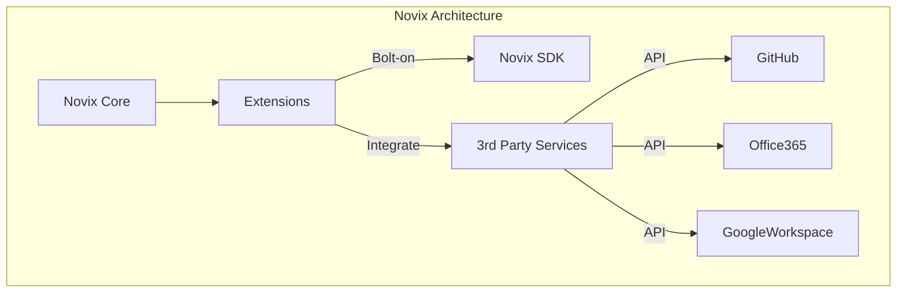
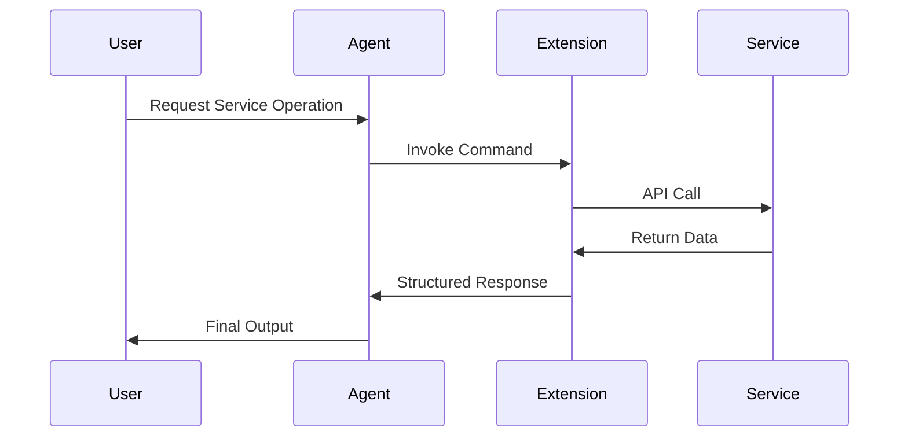
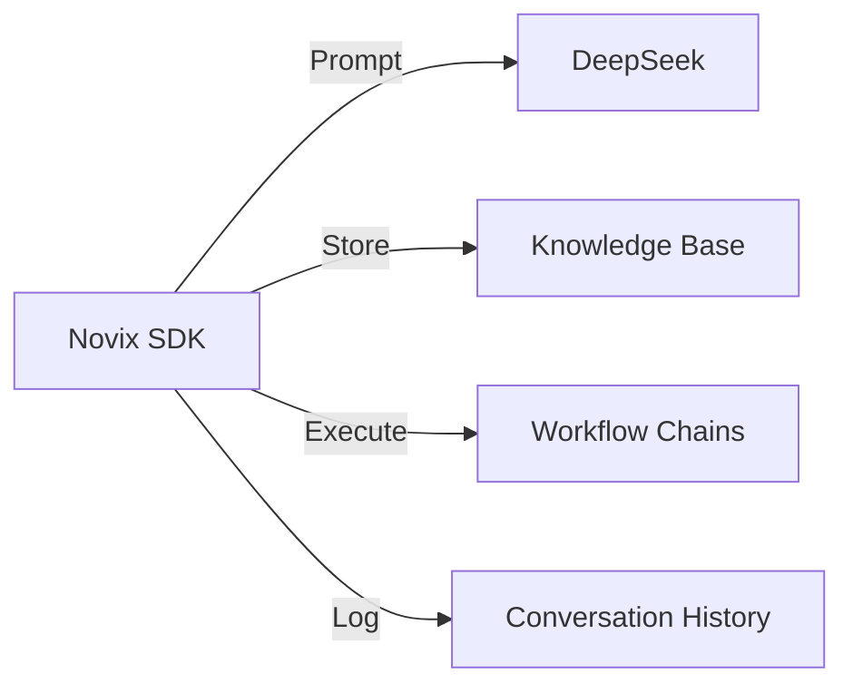
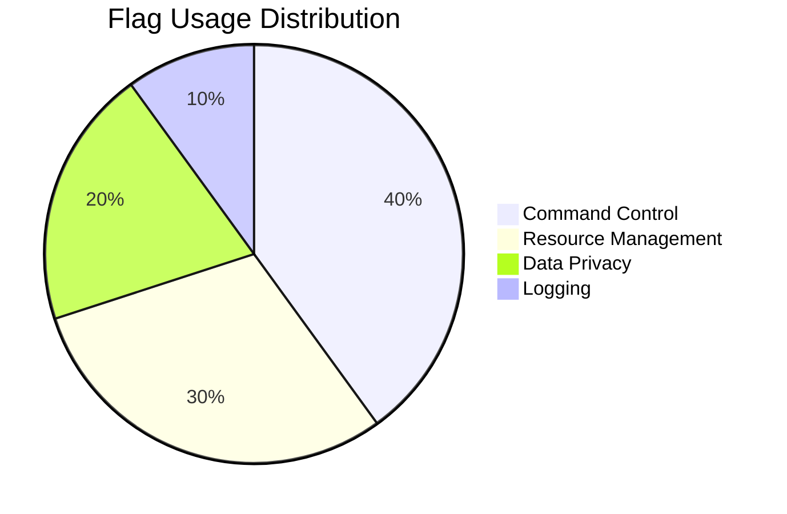
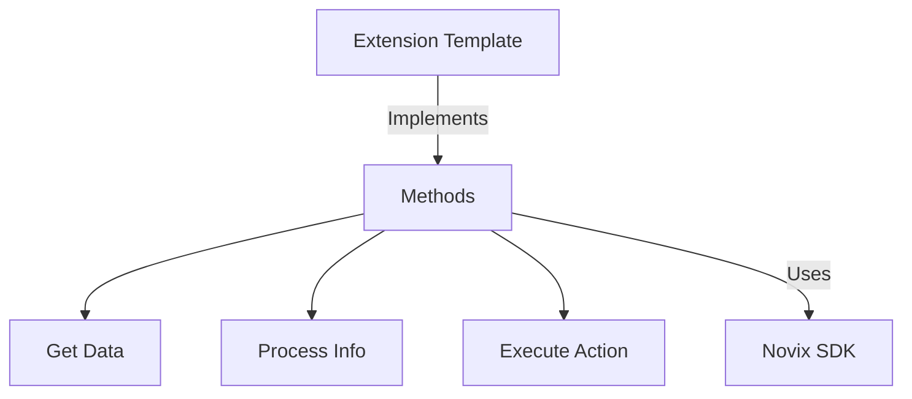
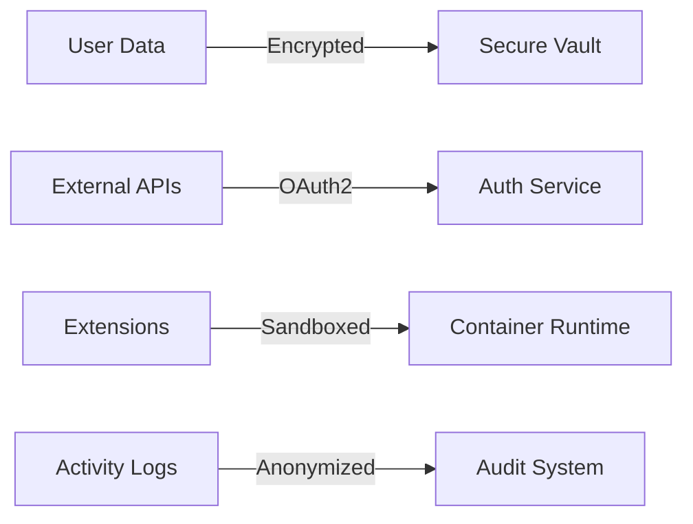
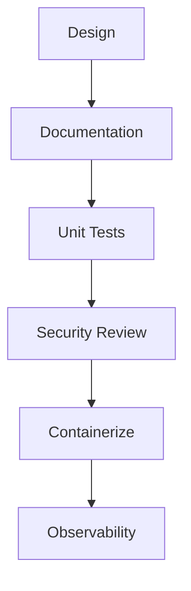

# Novix Extensions Framework



## Modular Extension System

Enhanced AI capabilities through pluggable components powered by DeepSeek.



## Core Components

**Authentication & Context Management**

```python
def __init__(self, **kwargs):
    # Initialize with DeepSeek integration
    self.ApiClient = NovixSDK(
        base_uri=os.getenv("NOVIX_URI"),
        api_key=kwargs.get("api_key", ""),
        agent_engine="deepseek"  # DeepSeek integration
    )
    
    # Context parameters
    self.agent_name = kwargs.get("agent_name", "deepseek")
    self.conversation_id = kwargs.get("conversation_id", None)
    self.WORKING_DIRECTORY = kwargs.get("conversation_directory", "WORKSPACE")
```

**SDK Operations Matrix**



Common Operations:**1. Agent Prompting**

```python
response = self.ApiClient.prompt_agent(
    agent_name="deepseek",
    prompt_name="Advanced Analysis",
    prompt_args={
        "user_input": query,
        "websearch": True,
        "browse_links": True
    }
)
```

**2. Memory Management**

```python
self.ApiClient.learn_text(
    agent_name="deepseek",
    text=research_data,
    collection_number=1024
)
```

**3. Chain Execution**

```python
result = self.ApiClient.run_chain(
    chain_name="Data Pipeline",
    agent_name="deepseek",
    user_input=dataset
)
```

## Control Flags Architecture



**Flag Implementation Examples**

```python
# Research workflow with DeepSeek
result = self.ApiClient.run_chain(
    chain_name="Market Research",
    chain_args={
        "websearch": True,
        "search_depth": 3,
        "log_output": False
    }
)

# Secure data processing
analysis = self.ApiClient.prompt_agent(
    prompt_args={
        "disable_commands": True,
        "analyze_user_input": True,
        "tts": False
    }
)
```

## Extension Development Framework



**Core Extensions**

| Extension | Key Capabilities   | DeepSeek Integration     |
| --------- | ------------------ | ------------------------ |
| GitHub    | Code review, CI/CD | PR analysis, Code gen    |
| Office365 | Email automation   | Document generation      |
| Oura Ring | Sleep analytics    | Wellness recommendations |
| Memory    | Context retention  | Knowledge correlation    |

**Security Architecture**



## Development Best Practices



**1. Extension Template**

```python
class DeepSeekAnalytics(Extensions):
    """Enhanced analytics with DeepSeek integration"""
    
    def __init__(self, API_KEY: str = "", **kwargs):
        self.commands = {
            "Analyze Dataset": self.advanced_analysis
        } if API_KEY else {}
        
    async def advanced_analysis(self, dataset: str) -> dict:
        """
        Performs DeepSeek-powered data analysis
        
        Args:
            dataset: Input data in CSV/JSON format
            
        Returns:
            Analysis report with insights
            
        Example:
            <execute>
            <name>Analyze Dataset</name>
            <dataset>sales_q3.csv</dataset>
            </execute>
        """
        # Analysis logic using DeepSeek API
```

## Operational Guidelines

| Consideration  | Implementation         | DeepSeek Integration        |
| -------------- | ---------------------- | --------------------------- |
| Rate Limiting  | Token Bucket           | Adaptive Query Optimization |
| Error Handling | Exponential Backoff    | Context-Aware Retries       |
| Data Privacy   | Field-Level Encryption | Anonymization Patterns      |
| Performance    | Async I/O              | Batch Processing            |
