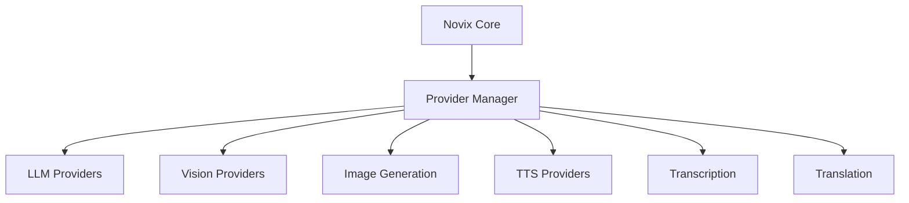

# Novix Providers Architecture

## Overview
Novix Providers are modular integrations with external AI services that enable multimodal capabilities. The architecture emphasizes:
- **Extensibility**: Easily add new providers with consistent interfaces
- **Modularity**: Swap providers without impacting core functionality
- **Multi-Modal Support**: Unified interface for diverse AI capabilities



Provider Categories
1. Logical Language Model (LLM) Providers
Core Function: Text generation and semantic understanding with enhanced logical reasoning

| Provider      | Models Supported     | Features                          |
|---------------|----------------------|-----------------------------------|
| OpenAI        | GPT-4, GPT-3.5       | High-accuracy reasoning           |
| DeepSeek      | R1, R2, Lite         | Code specialization, long-context |
| Azure OpenAI  | GPT-4, GPT-3.5       | Enterprise-grade security         |
| EzLocalAI     | GPT-J, GPT-NeoX      | Self-hosted, privacy-focused      |
| Anthropic     | Claude 2/3           | Constitutional AI                 |
| Google        | Gemini Pro/Ultra     | Multi-modal integration           |
| Hugging Face  | BLOOM, GPT-2         | Open-source models                |
| Default       | gpt4free             | Free tier (variable performance)  |

```python
class LLMProvider:
    def __init__(self, config: ProviderConfig):
        self.provider_name = config.name
        self.model = self._initialize_model(config)
        
    def _initialize_model(self, config) -> BaseModel:
        """Factory pattern for model initialization"""
        initializers = {
            "openai": OpenAIModel,
            "deepseek": DeepSeekModel,
            "azure": AzureOpenAIModel,
            "ezlocalai": EzLocalAIModel
        }
        return initializers[config.provider_type](config)
    
    async def generate_streaming_response(self, prompt: str) -> AsyncGenerator:
        """Yield tokens in real-time"""
        async for chunk in self.model.stream(prompt):
            yield chunk
```
2. Vision Providers
Core Function: Image analysis and visual understanding

| Provider      | Models Supported | Resolution Capability |
|---------------|------------------|-----------------------|
| OpenAI        | GPT-4 Vision     | 1280x1280             |
| DeepSeek      | DeepSeek-VL      | 2560x1440             |
| EzLocalAI     | DeepSeek-vl      | 1024x768              |
| Anthropic     | Claude 3         | 2048x2048             |
| Google        | Gemini Vision    | 4096x4096             |

```python
class VisionProcessor:
    def __init__(self, provider: VisionProvider):
        self.provider = provider
        
    def analyze_image(self, image: ImageInput) -> AnalysisResult:
        """Handle multiple image formats with DeepSeek integration"""
        if isinstance(image, str):
            if "deepseek" in self.provider.name.lower():
                image = self._process_deepseek_format(image)
            else:
                image = self._load_from_url(image)
        return self.provider.analyze(image)

    def _process_deepseek_format(self, url: str) -> Image:
        """Special handling for DeepSeek's image API"""
        return DeepSeekImageLoader.load(url)
```
Service Integration Matrix
```python
class ProviderServiceManager:
    SERVICE_MAP = {
        "openai": {
            "llm": OpenAIModel,
            "vision": OpenAIVision,
            "tts": OpenAITTS,
            "transcription": WhisperAPI
        },
        "deepseek": {
            "llm": DeepSeekModel,
            "vision": DeepSeekVision,
            "code_interpreter": DeepSeekCoder
        },
        "google": {
            "llm": GeminiModel,
            "vision": GeminiVision,
            "translation": GoogleTranslate
        }
    }

    def get_service(self, provider: str, service: str) -> BaseService:
        """Service factory with DeepSeek specialization"""
        if provider == "deepseek" and service == "code_interpreter":
            return DeepSeekCodeInterpreter(api_version="v2")
            
        if service not in self.SERVICE_MAP.get(provider, {}):
            raise ServiceUnavailableError
        return self.SERVICE_MAP[provider][service]()
```
Key Additions for DeepSeek:
1. Specialized Code Handling:
   ```python
   class DeepSeekCodeInterpreter:
    def __init__(self, api_version="v2"):
        self.api = DeepSeekAPI(version=api_version)
        
    def execute(self, code: str, lang="python") -> ExecutionResult:
        """Safe code execution environment"""
        sanitized_code = self.sanitize_input(code)
        return self.api.execute_code(
            code=sanitized_code,
            language=lang,
            timeout=30
        )
   ```
2. Long Context Optimization:
   ```python
   class DeepSeekContextManager:
    MAX_CONTEXT = 128_000  # tokens
    
    def __init__(self, model: str = "r2"):
        self.model = DeepSeekModel(model)
        
    def process_long_text(self, text: str) -> Summary:
        """Handle documents exceeding context window"""
        chunks = self._chunk_text(text)
        return self._process_chunks(chunks)
        
    def _chunk_text(self, text: str) -> list[str]:
        """Smart chunking with semantic boundaries"""
        return semantic_splitter.split(text, chunk_size=4000)
   ```
3. Multi-Modal Integration:
   ```python
   class DeepSeekMultiModal:
    def __init__(self):
        self.llm = DeepSeekModel("r2")
        self.vision = DeepSeekVision("vl-pro")
        
    def analyze_document(self, document: Document) -> Analysis:
        """Combine text and visual understanding"""
        text_analysis = self.llm.analyze(document.text)
        visual_analysis = self.vision.scan(document.images)
        return self._combine_results(text_analysis, visual_analysis)
   ```
   
