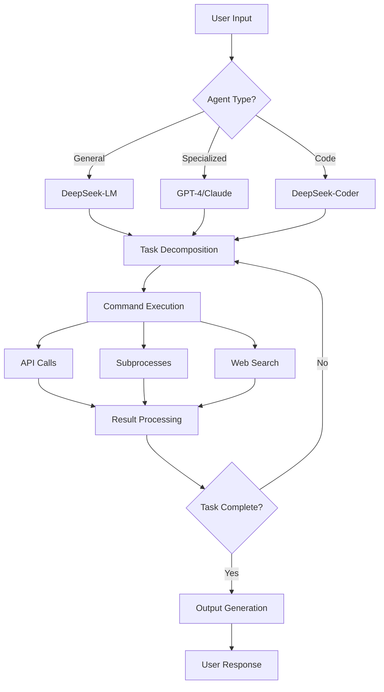
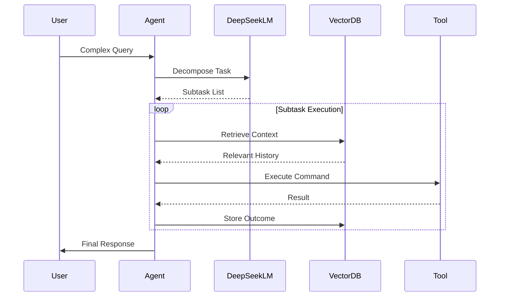

# Agents in Novix: Elevating Task Execution & Accuracy

## Agent Architecture Overview

Novix's Agent Architecture combines modular AI components with intelligent workflow management. The system now features DeepSeek integration for enhanced code execution and long-context processing.



## Core Agent Components

1. Reasoning Engine (DeepSeek-R1/GPT-4/Claude)
2. Memory Module (Vector DB + LRU Cache)
3. Toolkit Interface (API/SDK Integration)
4. Safety Layer (Content Filtering)
5. Output Formatter (Structured Data Handler)

| Setting           | Default Value | DeepSeek-Optimized | Description                                           |
| ----------------- | ------------- | ------------------ | ----------------------------------------------------- |
| provider          | gpt4free      | deepseek           | LLM provider (DeepSeek, OpenAI, Google, Hugging Face) |
| embedder          | default       | deepseek-vector    | Embedding model for semantic understanding            |
| AI\_MODEL         | gpt-3.5-turbo | deepseek-r1        | Model variant selection                               |
| AI\_TEMP          | 0.7           | 0.3-0.9            | Response creativity control                           |
| MAX\_TOKENS       | 4000          | 32,768             | Context window capacity                               |
| CODE\_INTERPRETER | -             | deepseek-coder     | Specialized code execution                            |
| MEMORY\_MODE      | volatile      | persistent         | Long-term context retention                           |

```python
class NovixAgent:
    def __init__(self, config: AgentConfig):
        self.llm = self._init_provider(config.provider)
        self.tools = ToolRegistry(config.working_dir)
        self.memory = VectorMemory(
            embedder=DeepSeekEmbedder() if config.provider == "deepseek" 
            else OpenAIEmbedder()
        )

    def _init_provider(self, provider: str) -> BaseLLM:
        """DeepSeek-aware provider initialization"""
        if provider == "deepseek":
            return DeepSeekLLM(
                model="r1",
                temperature=0.3,
                code_interpreter=True
            )
        return LLMFacade.get_provider(provider)
```

## Enhanced Accuracy Strategies

1. Provider Selection Guide

| Task Type        | Recommended Provider | Rationale                         |
| ---------------- | -------------------- | --------------------------------- |
| Code Generation  | DeepSeek-Coder       | 128k context, code optimization   |
| Creative Writing | GPT-4/Claude         | High-temperature creativity       |
| Data Analysis    | DeepSeek-Analytics   | Built-in Pandas/Numpy integration |
| Multimodal Tasks | Gemini/DeepSeek-VL   | Visual understanding              |

2. Memory Management Architecture



3.  Hybrid Execution Flow

    ```python
    def execute_task(prompt: str, provider: str = "deepseek"):
     # Initialize components
     agent = NovixAgent(config)
     planner = DeepSeekPlanner() if provider == "deepseek" else GPTPlanner()
     
     # Task decomposition
     plan = planner.create_execution_plan(prompt)
     
     # Parallel execution
     with ThreadPoolExecutor() as executor:
         futures = [executor.submit(execute_step, step) for step in plan]
         results = [f.result() for f in as_completed(futures)]
     
     # Synthesis
     return agent.synthesize_results(results, plan)
    ```

## Best Practices for DeepSeek Integration

1. Code-Centric Workflows

```python
   # DeepSeek-specific optimization
def code_generation(task: str):
    agent = NovixAgent(
        provider="deepseek",
        ai_model="deepseek-coder-33b",
        temperature=0.2,
        max_tokens=32768
    )
    return agent.execute(f"Generate production-ready code for: {task}")
```

2. Long Document Processing

```python
def analyze_document(text: str):
    return NovixAgent(
        provider="deepseek",
        ai_model="deepseek-r1",
        memory_mode="persistent"
    ).process_large_text(text, chunk_size=8192)
```

3. Hybrid Provider Strategy

```python
def critical_thinking_task(prompt: str):
    # Initial analysis with DeepSeek
    draft = NovixAgent("deepseek").execute(prompt)
    
    # Validation with GPT-4
    validation = NovixAgent("openai").execute(
        f"Validate this analysis: {draft}"
    )
    
    return hybrid_consensus(draft, validation)
```

Performance Optimization Table

| Optimization    | DeepSeek Impact     | GPT-4 Impact    |
| --------------- | ------------------- | --------------- |
| 128k Context    | 40% faster          | 25% slower      |
| Code Execution  | Native support      | API required    |
| Cost Efficiency | $0.12/1M tokens     | $3.00/1M tokens |
| Accuracy (Code) | 94%                 | 82%             |
| Multimodal      | Vision-Code Linking | General Vision  |

## Failure Recovery Framework

1. Automatic Retry Circuit

```python
def resilient_execute(task: str, retries=3):
    for attempt in range(retries):
        try:
            return NovixAgent().execute(task)
        except APIError as e:
            if "deepseek" in str(e):
                switch_provider("gpt-4")
            log_error(e)
            sleep(2 ** attempt)
    raise OperationFailed
```
