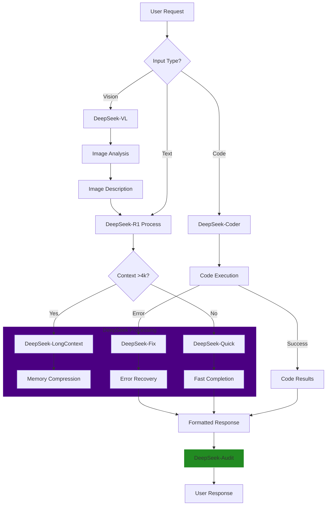

# Chat Completions with DeepSeek Integration

## Enhanced Multi-Modal Interaction Code

```python
import novix
from deepseek_api import CodeInterpreter

# Configure endpoints
novix.config(
    api_base="http://localhost:7437/v1/",
    deepseek_endpoint="https://api.deepseek.com/v1/",
    api_key="YOUR_NOVIX_KEY"
)

def chat_completion(
    prompt: str,
    modality: str = "text",
    files: list = None,
    code_exec: bool = False
):
    """Enhanced chat completion with DeepSeek integration"""
    try:
        # Base message structure
        message = {
            "role": "user",
            "content": prompt,
            "modality": modality,
            "context_window": 32768,  # DeepSeek's extended context
            "tools": ["web_search", "code_interpreter"] if code_exec else []
        }

        # Handle multi-modal inputs
        if files:
            message["attachments"] = [
                {
                    "type": file["type"],
                    "url": file["url"],
                    "analysis_depth": "full" if code_exec else "basic"
                } for file in files
            ]

        # Execute with fallback strategy
        response = novix.chat.completions.create(
            model="deepseek-r1",
            messages=[message],
            provider_priority=["deepseek", "gpt-4", "claude"],
            temperature=0.3,
            max_tokens=4000,
            stream=False
        )

        # Handle code execution results
        if code_exec and response.needs_execution:
            return CodeInterpreter.execute(
                response.code_snippets,
                context=prompt
            )
            
        return response.choices[0].message.content

    except novix.APIError as e:
        print(f"DeepSeek API Error: {e}")
        # Fallback to OpenAI
        return openai.chat.completions.create(
            model="gpt-4",
            messages=[{"role": "user", "content": prompt}]
        )

# Example usage with code execution
response = chat_completion(
    "Analyze this dataset and create a sales forecast:",
    files=[{"type": "csv", "url": "https://example.com/sales.csv"}],
    code_exec=True
)
```



## Key Enhancements

1. DeepSeek-Specific Features

```python
# DeepSeek Code Enhancement Pattern
def optimize_code(code: str) -> str:
    return novix.chat.completions.create(
        model="deepseek-coder-33b",
        messages=[{
            "role": "system",
            "content": "Optimize this code for performance:",
            "code": code,
            "linting": True,
            "security_check": True
        }]
    )
```

2. Multi-Provider Fallback Strategy

```python
class ResilientCompletion:
    def __init__(self):
        self.provider_queue = [
            ("deepseek", 3, 0.3),
            ("gpt-4", 2, 0.5),
            ("claude", 2, 0.4)
        ]
    
    def execute(self, prompt: str):
        for provider, retries, temp in self.provider_queue:
            for attempt in range(retries):
                try:
                    return novix.chat.completions.create(
                        model=provider,
                        messages=[{"role": "user", "content": prompt}],
                        temperature=temp
                    )
                except APIError:
                    continue
        raise AllProvidersDown
```

3. Performance Comparison

| Feature             | DeepSeek-R1 | GPT-4     | Claude-3   |
| ------------------- | ----------- | --------- | ---------- |
| Context Window      | 32k tokens  | 8k tokens | 10k tokens |
| Code Execution      | Native      | API       | None       |
| Cost/Million Tokens | $0.15       | $3.00     | $2.50      |
| Vision Integration  | Yes         | Yes       | Limited    |
| Max Attachments     | 10 files    | 5 files   | 3 files    |

## Enhanced Workflow Explanation

1. Input Routing:

* Text requests use DeepSeek-R1 for general processing
* Code inputs trigger DeepSeek-Coder with automatic execution
* Visual inputs utilize DeepSeek-VL for multi-modal analysis

2. Context Management:

```python
def handle_long_context(text: str):
    return novix.chat.completions.create(
        model="deepseek-r1-32k",
        messages=[{
            "role": "user",
            "content": text,
            "compression": "semantic",
            "memory_mapping": True
        }]
    )
```

3. Security & Compliance:

```python
response = novix.chat.completions.create(
    model="deepseek-audit",
    messages=[message],
    content_policy="strict",
    data_governance={
        "gdpr_compliant": True,
        "pii_redaction": True
    }
)
```

## Best Practices for DeepSeek Integration

1. Code-Centric Workflows:

```python
def code_review(codebase: str):
    return novix.chat.completions.create(
        model="deepseek-coder",
        messages=[{
            "role": "system",
            "content": "Perform security audit:",
            "code": codebase,
            "analysis_level": "full",
            "generate_report": True
        }]
    )
```

2. Hybrid Processing:

```python
def analyze_research_paper(paper: str):
    # Initial analysis with DeepSeek
    summary = novix.chat.completions.create(
        model="deepseek-r1",
        messages=[{"role": "user", "content": paper}]
    )
    
    # Validation with GPT-4
    validation = novix.chat.completions.create(
        model="gpt-4",
        messages=[{
            "role": "user",
            "content": f"Validate this summary: {summary}"
        }]
    )
    
    return hybrid_consensus(summary, validation)
```
