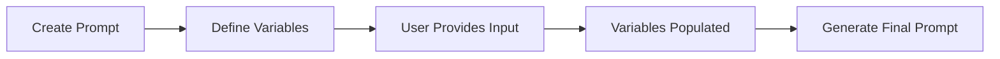
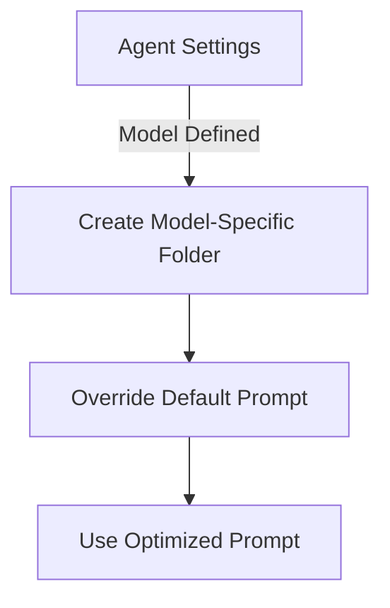
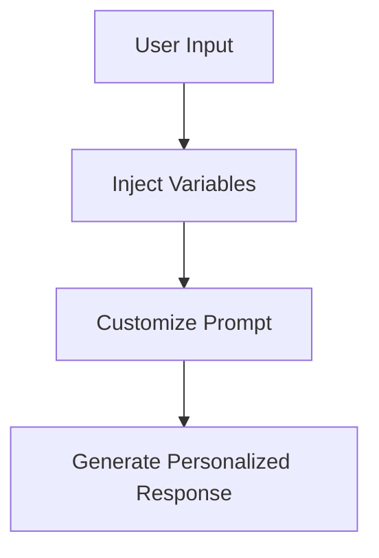

# Custom Prompts for Agent Interaction

The Prompts feature empowers users to create, modify, and delete tailored prompts that control the behavior of their agents. By specifying a prompt name, its content, and input variables, users can design custom interactions that allow the agent to perform specific tasks, adapting to varied requirements and workflows. This capability enables a high degree of personalization, making agents not only more responsive but also more effective in handling unique use cases.

## Prompt Formats: Dynamic Customization

Each prompt follows a specific structure that allows for dynamic variable insertion. When crafting your prompt, variables like `{user_input}` can be easily integrated. Upon execution, the variables are populated with real-time user input, allowing the prompt to evolve based on contextual data.

**Example:**\
Consider a prompt like:\
"Do {user\_input} {when}."

If the user provides the following input:

* `task = "the dishes"`
* `when = "now"`

The result will be:\
"Do the dishes now."

This format provides flexibility, letting you design prompts that adapt seamlessly to any situation or request the agent encounters.



## Model-Specific Prompt Overrides: Tailored for Performance

To optimize interaction with various models, prompt overrides can be implemented within the Novix\prompts directory. By creating model-specific folders corresponding to your agent's AI model (as defined in the agent settings), you can ensure that the agent uses more efficient prompts designed for the unique strengths and limitations of different models.

Example:\
For GPT-4 (with an 8K token limit), you might choose to override the default instruction prompt to better match the model's token capacity. Instead of using the default "500-word limit," you could modify the prompt to indicate:\
"This agent has a 4000-word processing limit."

This customization helps to avoid confusion and maximizes the model’s potential by leveraging prompts optimized for each specific model’s constraints.



**Note**: At present, this override functionality is done manually by adjusting folder structures rather than through a user interface.

**Predefined Injection Variables: Enhance Contextualization**\
Predefined injection variables allow for dynamic insertion of key data into your prompts, making the interaction feel more personalized and contextually aware. These variables automatically adapt based on real-time inputs, user history, and other dynamic factors:

```
•	{agent_name}: Injects the agent's designated name, personalizing the interaction.
•	{context}: Pulls in the relevant memory context, enabling the agent to recall and build upon previous interactions. This works when {user_input} is part of the prompt argument.
•	{date}: Inserts the current date and timestamp, making your prompts time-sensitive if required.
•	{conversation_history}: Injects the ongoing conversation history, allowing the agent to reference past exchanges for improved continuity.
•	{COMMANDS}: Injects the full list of available commands and allows the agent to automatically execute commands based on its own suggestions, creating a responsive and proactive workflow.
•	{command_list}: Provides the available commands list without executing any commands. This is ideal for validation steps where you want the agent to assess possible actions without taking them immediately.
•	{STEPx}: Injects the result from a specific step in a multi-step chain, enabling more complex and structured workflows. For example, {STEP1} will automatically insert the response generated by the first step in a chain.
```

**Creative Example of Prompt Customization**\
Let’s consider an example where you want the agent to help with a task and inject the necessary contextual information. You could create a prompt like this:

**Prompt:**\
"Hi {agent\_name}, based on the current situation, {context} and {conversation\_history}, please assist with {user\_input}. Today's date is {date}."

When the user inputs:\
• user\_input = "checking the weather"\
• context = "The weather forecast was updated last night."\
• conversation\_history = "We previously discussed the weather for the week."

The final prompt would be:\
"Hi Agent\_X, based on the current situation, The weather forecast was updated last night and We previously discussed the weather for the week, please assist with checking the weather. Today's date is 2025-01-17."


