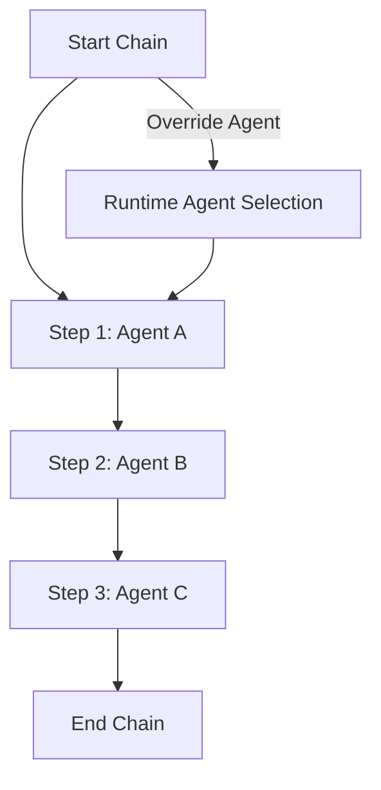
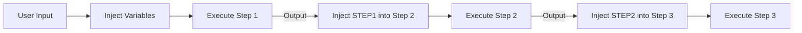
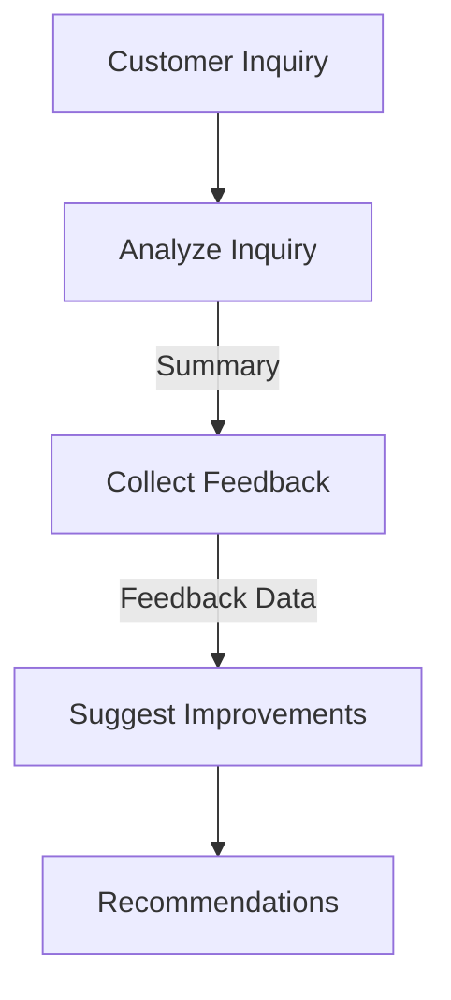

# Chains: Automating Complex Workflows with Precision

A chain is a sequence of interconnected actions, where the output of one step serves as the input for the next. This concept allows for the automation of complex workflows, enabling an AI agent to perform a series of tasks in a specific order. Chains are commonly used to structure multi-step processes, such as running prompts, executing commands, or invoking other chains, facilitating more efficient task execution without manual supervision.

## Flexibility in Chain Configuration

Chains provide flexibility in defining both the sequence and the agents responsible for each step. You can assign a different agent to each individual step within the chain, or you can override the agent used for the entire chain at runtime. This allows for specialized handling of each task within the chain, ensuring that the most appropriate agent is used for each operation.

By default, chains accept a single input: `user_input`. However, if the chain doesn’t require this input or if custom data is needed, you can override the input during runtime. This gives you the ability to tailor the workflow to suit the specific requirements of each execution.

Chains are designed to be dynamic. You can create, update, or delete chains as needed, offering the flexibility to adjust workflows on the fly. This provides developers with the ability to manage and optimize processes over time.

**Predefined Injection Variables**\
To enhance the capability of chains, several predefined injection variables can be used within command and prompt arguments. These variables dynamically inject relevant data at runtime, ensuring that each task in the chain has the appropriate context. The most commonly used variables include:

* {agent\_name}: Injects the name of the current agent executing the task.
* {context}: Injects the agent’s memory context, providing historical information for decision-making. This is applicable when the user\_input is part of the prompt.
* {date}: Injects the current date and timestamp, useful for time-sensitive tasks or logging.
* {conversation\_history}: Injects the full conversation history, allowing the agent to maintain continuity across multiple steps.
* {COMMANDS}: Injects a list of available commands and allows automatic execution based on agent recommendations.
* {command\_list}: Injects a list of commands without automatically executing them, useful for validation or review.
* {STEPx}: Injects the output of a specific step from a chain. For example, {STEP1} would inject the result of the first step, making it available for use in subsequent steps.

**Key Advantages of Using Chains**

1. **Modular Workflow Automation**: Chains allow for the automation of complex, multi-step processes. Each step is independent, enabling easier updates, customization, and troubleshooting.
2. **Agent Specialization**: Different agents can be assigned to each step, ensuring that tasks are handled by the most suitable entity. This provides flexibility in executing specialized actions as part of a larger workflow.
3. **Dynamic Input Handling**: While chains default to using user\_input, inputs can be customized and overridden at runtime. This allows for more complex and dynamic workflows that don’t rely solely on user-provided data.
4. **Enhanced Control**: Developers have full control over the chain execution. They can modify the chain’s structure, input, and behavior based on specific needs, making it easier to build, iterate, and refine automation processes.

**Example: Defining a Chain for Complex Automation**\
Let’s consider an example where you want to automate the process of gathering customer feedback and suggesting product improvements:

1. Step 1: Analyze Customer Inquiry

* Use an AI agent to analyze the customer’s inquiry, determining sentiment and intent.
* Output: Categorized summary of the inquiry.

2. Step 2: Collect Feedback

* Trigger another agent to ask follow-up questions to gather customer feedback.
* Output: Feedback data.

3. Step 3: Suggest Improvements

* Analyze the feedback using another agent or a command to generate suggestions for product improvements.
* Output: A set of improvement recommendations.

In this chain, each step depends on the output of the previous one. Additionally, predefined variables such as {conversation\_history} or {context} could be used to ensure that each step has the relevant context for making informed decisions.

