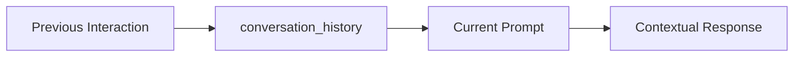
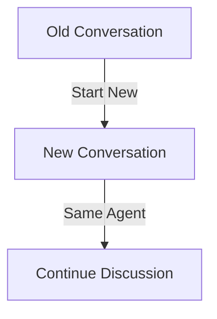
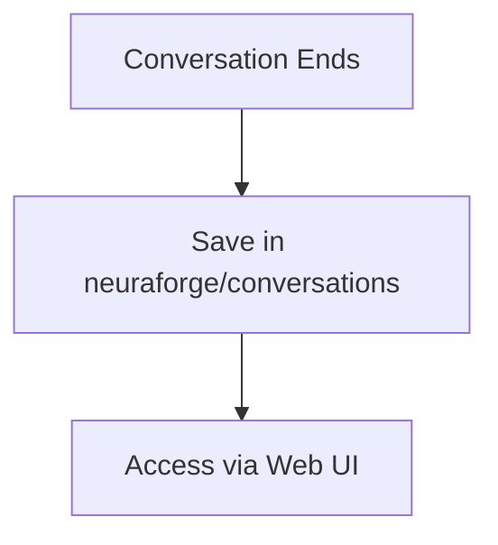
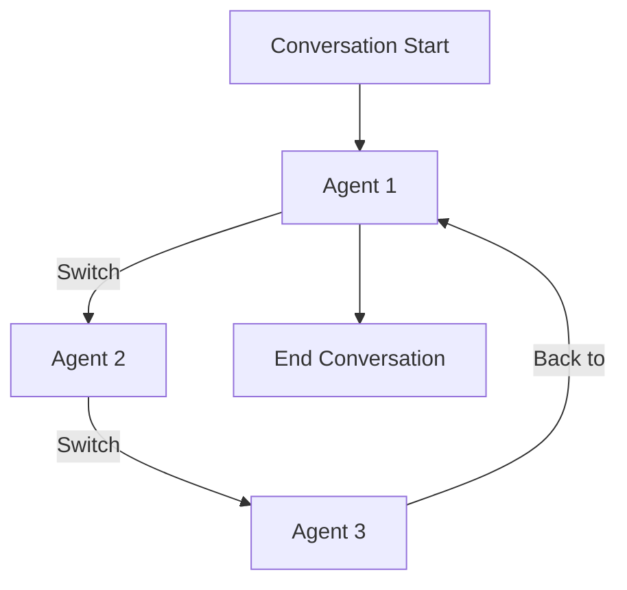

# Conversations: Maintaining Context and Flexibility

Injecting `{conversation_history}` into a prompt enables the AI to incorporate the last five interactions of a conversation, providing it with context for the next response. This functionality is crucial for maintaining continuity in conversations, allowing the AI to remain aware of prior exchanges and generate more contextually relevant responses.

If you prefer to continue discussing the same set of documents or topics without retaining the conversation history, simply start a new conversation. You can continue interacting with the same agent, without the need to reintroduce or retrain the documentation. This offers flexibility, allowing you to keep conversations focused and context-specific as needed.

All conversations are automatically saved in the novix/conversations directory and can be accessed through the Novix Streamlit Web UI for review and management.

Additionally, conversations are not restricted to a single agent. You can seamlessly switch between agents within a conversation, simulating a multi-agent dialogue. This is particularly useful for orchestrating collaborative workflows or managing a team of agents, each with distinct expertise, to handle various tasks or perspectives within a shared context.

