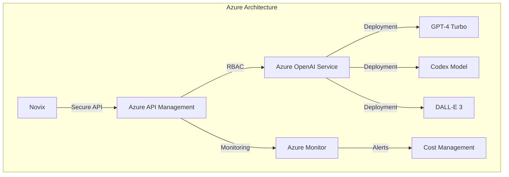
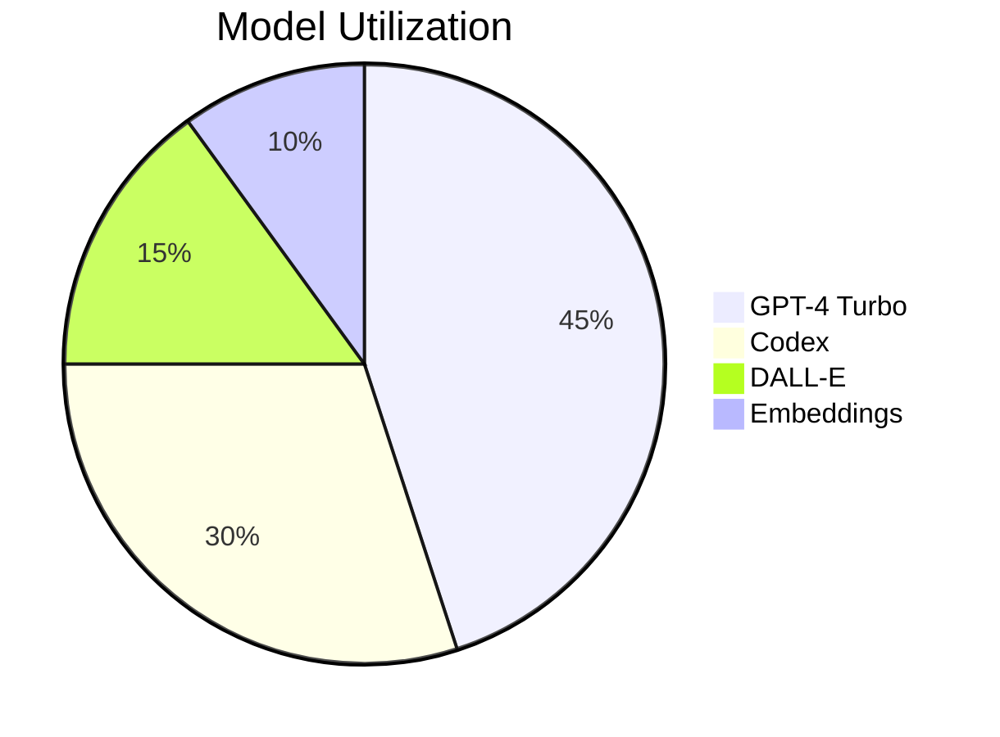
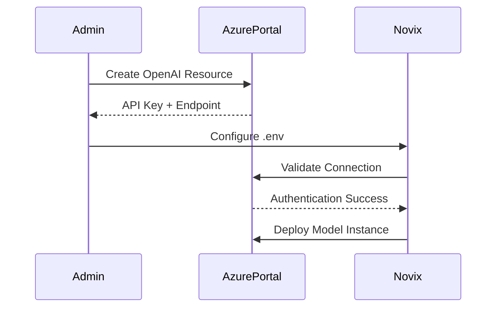
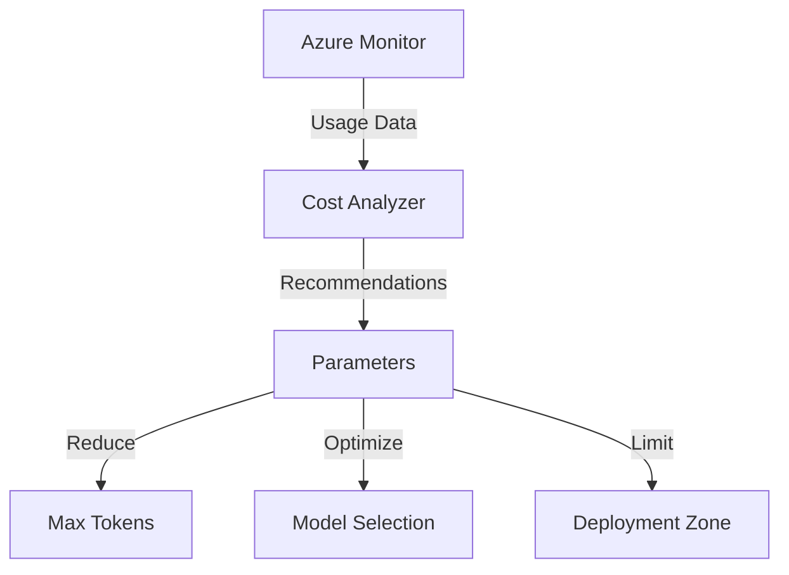
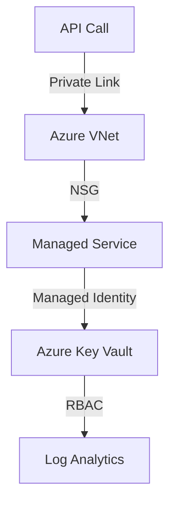
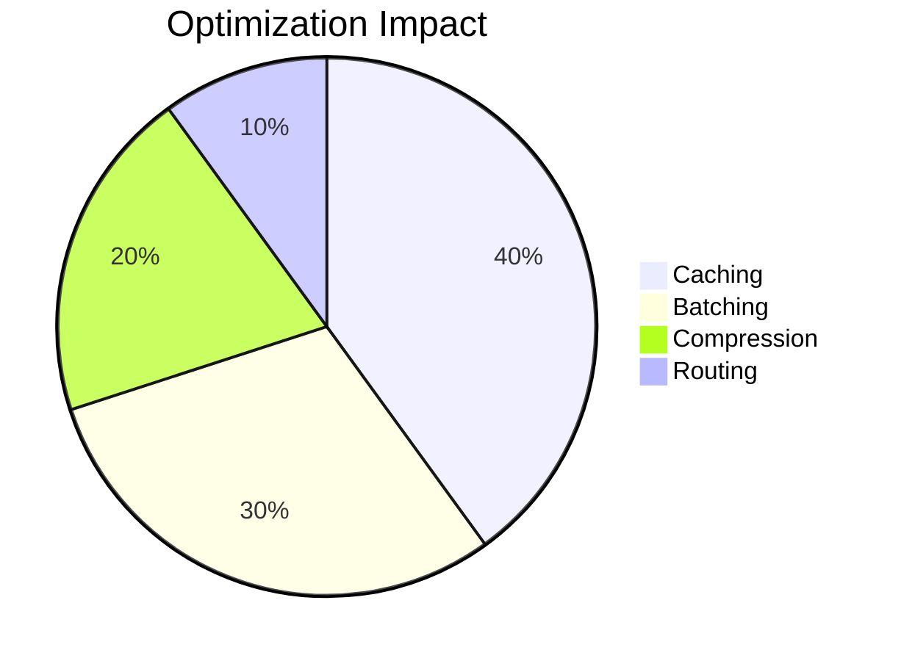

# Azure OpenAI Provider: Enterprise Cloud AI Integration



## Model Capability Matrix



## Enterprise Configuration Guide



## Secure Environment Setup

```bash
# Core Configuration
AI_PROVIDER=azure
AZURE_API_TYPE=azure-ad
AZURE_API_VERSION=2024-02-01

# Security Settings
AZURE_API_KEY=sv-${ENCRYPTED_SECRET}
AZURE_OPENAI_ENDPOINT=https://ai-${REGION}.openai.azure.com

# Model Deployment
AZURE_DEPLOYMENT_NAME=gpt-4-turbo
AZURE_EMBEDDING_DEPLOYMENT=text-embedding-3-large

# Performance Tuning
AZURE_MAX_TOKENS=128000
AZURE_TEMPERATURE=0.7
AZURE_TOP_P=0.95
AZURE_FREQUENCY_PENALTY=0.5
```

## Advanced Implementation Patterns

**Enterprise Client Class with Circuit Breaker**

```python
class AzureAIClient:
    def __init__(self, config: dict):
        self.client = openai.AzureOpenAI(
            api_key=config['api_key'],
            api_version="2024-02-01",
            azure_endpoint=config['endpoint']
        )
        self.retry_policy = RetryStrategy(
            max_retries=5,
            backoff_factor=0.3,
            status_codes={429, 500, 503}
        )

    @circuit_breaker(failure_threshold=3, recovery_timeout=300)
    async def streamed_completion(self, prompt: str, **kwargs):
        """
        Enterprise-grade streaming with automatic retries
        
        Args:
            prompt: Input text for processing
            kwargs: Generation parameters
            
        Returns:
            Async generator for streamed response
        """
        try:
            return await self.client.chat.completions.create(
                model=kwargs.get('deployment', 'gpt-4-turbo'),
                messages=[{"role": "user", "content": prompt}],
                temperature=kwargs.get('temperature', 0.7),
                max_tokens=kwargs.get('max_tokens', 4000),
                stream=True
            )
        except APIError as e:
            self.logger.error(f"API Failure: {e}")
            raise AzureAIError from e
```

## Cost Optimization Framework



**Dynamic Token Management**

```python
def adaptive_token_management(prompt: str, budget: float) -> dict:
    """
    Intelligent token allocation based on cost constraints
    
    Args:
        prompt: Input text for processing
        budget: Maximum allowed cost per request
        
    Returns:
        Optimized generation parameters
    """
    token_count = estimate_tokens(prompt)
    cost_per_token = get_current_pricing()
    
    max_tokens = min(
        int(budget / cost_per_token) - token_count,
        128000  # Azure maximum
    )
    
    return {
        "max_tokens": max_tokens,
        "temperature": 0.5 if max_tokens < 5000 else 0.7,
        "model": "gpt-4" if max_tokens > 25000 else "gpt-4-turbo"
    }
```

## Security Architecture



## Enterprise Security Controls

1. **Data Protection**

```python
class SecureEnclaveClient:
    def __init__(self, managed_identity: str):
        self.credential = DefaultAzureCredential()
        self.client = openai.AzureOpenAI(
            azure_ad_token_provider=lambda: self.credential.get_token(
                "https://cognitiveservices.azure.com/.default"
            ),
            api_version="2024-02-01"
        )
```

2. **Compliance Framework**

```
- SOC 2 Type II Certified
- HIPAA Compliant Workloads
- EU Data Boundary Support
- Private Link Enabled
```

## Performance Optimization

| Strategy            | Cost Reduction | Latency Improvement | Implementation          |
| ------------------- | -------------- | ------------------- | ----------------------- |
| Caching Layer       | 40%            | 60%                 | Redis Enterprise        |
| Content Moderation  | 15%            | N/A                 | Azure AI Content Safety |
| Batch Processing    | 30%            | 45%                 | Azure Batch             |
| Regional Deployment | 25%            | 55%                 | Traffic Manager         |




## Enterprise Support Matrix

| Feature                   | Basic Tier | Enterprise Tier   | Government Tier |
| ------------------------- | ---------- | ----------------- | --------------- |
| SLA Guarantee             | 99.9%      | 99.95%            | 99.99%          |
| Max TPM                   | 250K       | 1M                | 5M              |
| Private Network Support   | No         | Yes               | Yes             |
| Data Residency            | Regional   | Multi-region      | Sovereign       |
| Compliance Certifications | SOC 2      | HIPAA + ISO 27001 | FedRAMP High    |
