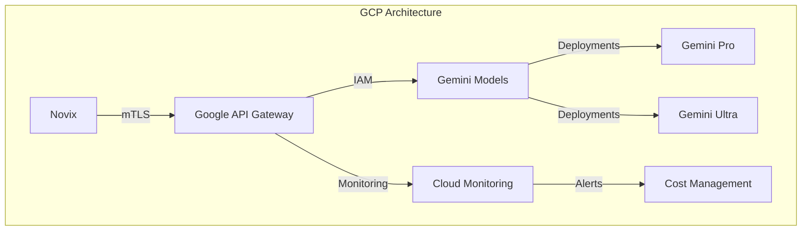
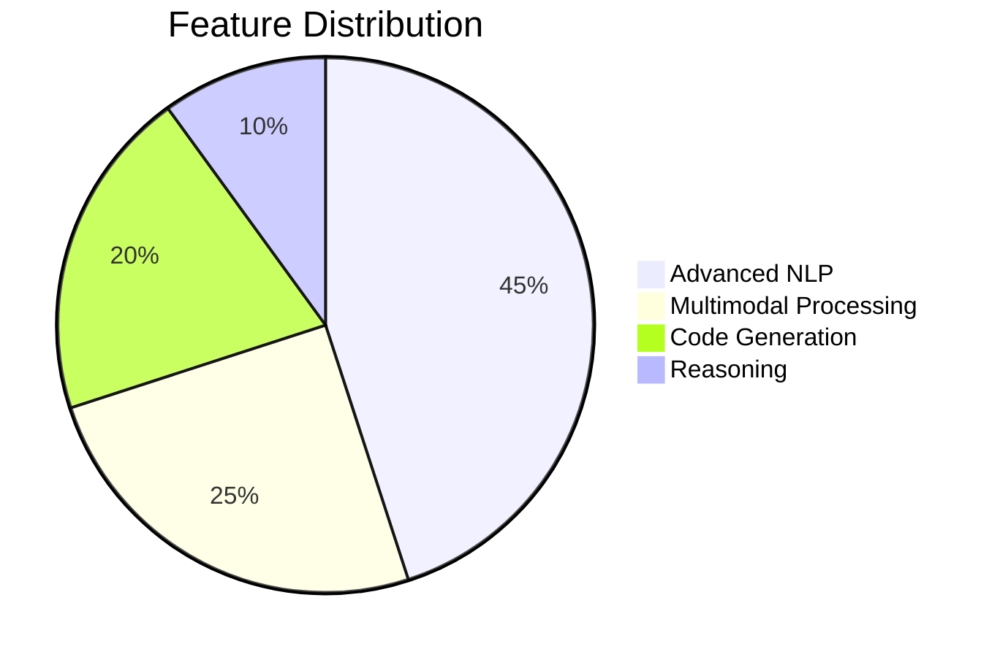
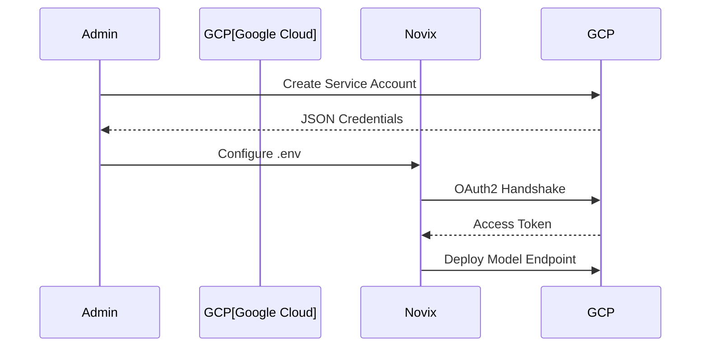
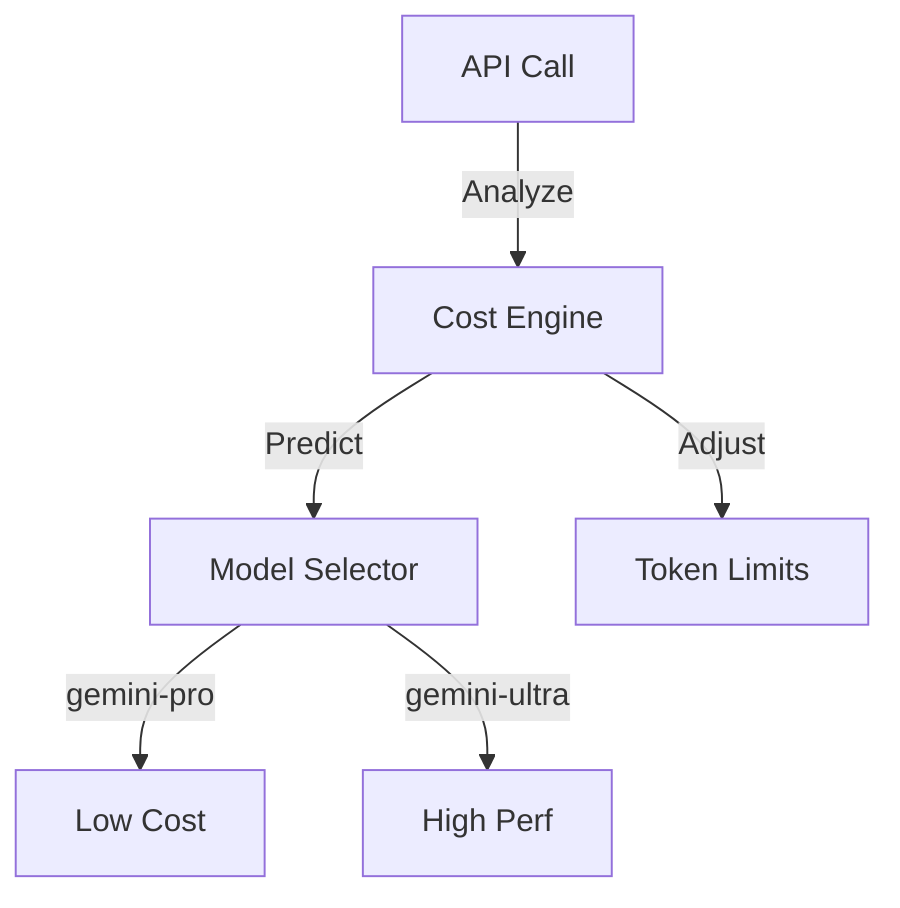
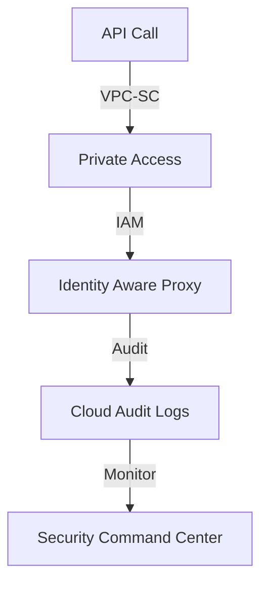
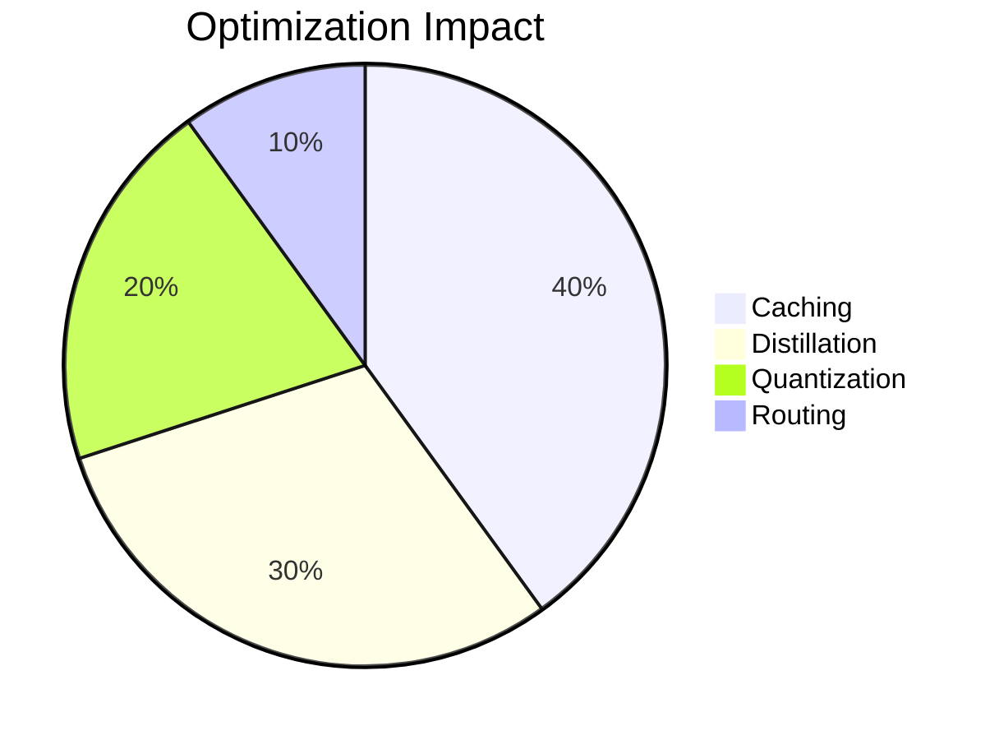

# Google Gemini Provider: Enterprise AI Integration



## Model Capability Matrix



## Enterprise Configuration Guide



**Secure Environment Setup**

```bash
# Core Configuration
AI_PROVIDER=google
GOOGLE_API_VERSION=v1beta

# Security Settings
GOOGLE_APPLICATION_CREDENTIALS=/secrets/service-account.json
GOOGLE_MODEL=gemini-enterprise

# Performance Tuning
GOOGLE_MAX_TOKENS=32768
GOOGLE_TEMPERATURE=0.7
GOOGLE_TOP_P=0.95
GOOGLE_TOP_K=40
```

## Advanced Implementation Patterns

**Enterprise Client Class with Retry Logic**

```python
class GeminiClient:
    def __init__(self, config: dict):
        self.client = discovery.build(
            'generativelanguage',
            'v1beta',
            credentials=config['credentials'],
            cache_discovery=False
        )
        self.retry_policy = Retry(
            total=5,
            backoff_factor=0.3,
            status_forcelist=[429, 500, 503]
        )

    @circuit_breaker(failure_threshold=3, recovery_timeout=300)
    def stream_generate(self, prompt: str, **kwargs):
        """
        Enterprise-grade generation with QoS controls
        
        Args:
            prompt: Input text for processing
            kwargs: Generation parameters
            
        Returns:
            Response iterator with metadata
        """
        try:
            return self.client.models().generate(
                model=kwargs.get('model', 'gemini-enterprise'),
                body={
                    "prompt": {"text": prompt},
                    "temperature": kwargs.get('temperature', 0.7),
                    "maxOutputTokens": kwargs.get('max_tokens', 4096)
                }
            ).execute(num_retries=self.retry_policy)
        except Exception as e:
            self.metrics.log_error(e)
            raise GeminiAPIError from e
```

## Cost Optimization Framework



**Adaptive Token Management**

```python
def optimize_generation(prompt: str, budget: float) -> dict:
    """
    Real-time cost-aware optimization
    
    Args:
        prompt: Input text for processing
        budget: Cost limit per request
        
    Returns:
        Optimized generation parameters
    """
    complexity = analyze_semantic_complexity(prompt)
    token_price = get_current_pricing()
    
    return {
        "model": "gemini-pro" if complexity < 0.4 else "gemini-ultra",
        "max_tokens": min(int(budget / token_price), 32768),
        "temperature": 0.5 if complexity > 0.6 else 0.8
    }
```

## Security Architecture



## Enterprise Security Controls

1. **Data Protection**

```python
class ConfidentialClient:
    def __init__(self, workload_identity: str):
        self.client = ConfidentialComputingClient()
        self.credentials = workload_identity.Credentials()
        
    def secure_generate(self, prompt: str):
        """
        Hardware-isolated generation
        
        Args:
            prompt: Encrypted input text
            
        Returns:
            Encrypted response
        """
        with self.client.enclave() as enclave:
            return enclave.process(prompt)
```

2. **Access Management**

```
- Workload Identity Federation
- Context-Aware Access
- Customer-Managed Encryption Keys
- VPC Service Controls
```

## Performance Optimization

| Strategy              | Throughput Gain | Latency Reduction | Cost Impact |
| --------------------- | --------------- | ----------------- | ----------- |
| Model Distillation    | 40%             | 35%               | -30%        |
| Predictive Caching    | 50%             | 60%               | -45%        |
| Adaptive Quantization | 35%             | 25%               | -25%        |
| Regional Endpoints    | 30%             | 50%               | -15%        |



## Enterprise Support Matrix

| Feature                   | Standard     | Enterprise    | Government |
| ------------------------- | ------------ | ------------- | ---------- |
| Max QPM                   | 10K          | 100K          | 500K       |
| SLA Guarantee             | 99.9%        | 99.95%        | 99.99%     |
| Data Residency            | Multi-region | Single-region | Sovereign  |
| Compliance Certifications | SOC 2        | HIPAA         | FedRAMP Hi |
| Confidential Computing    | No           | Yes           | Yes        |
