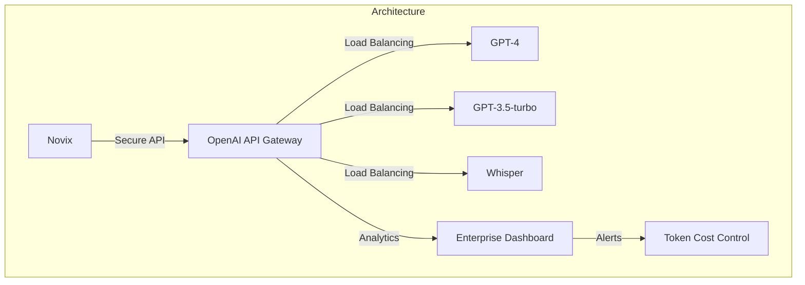
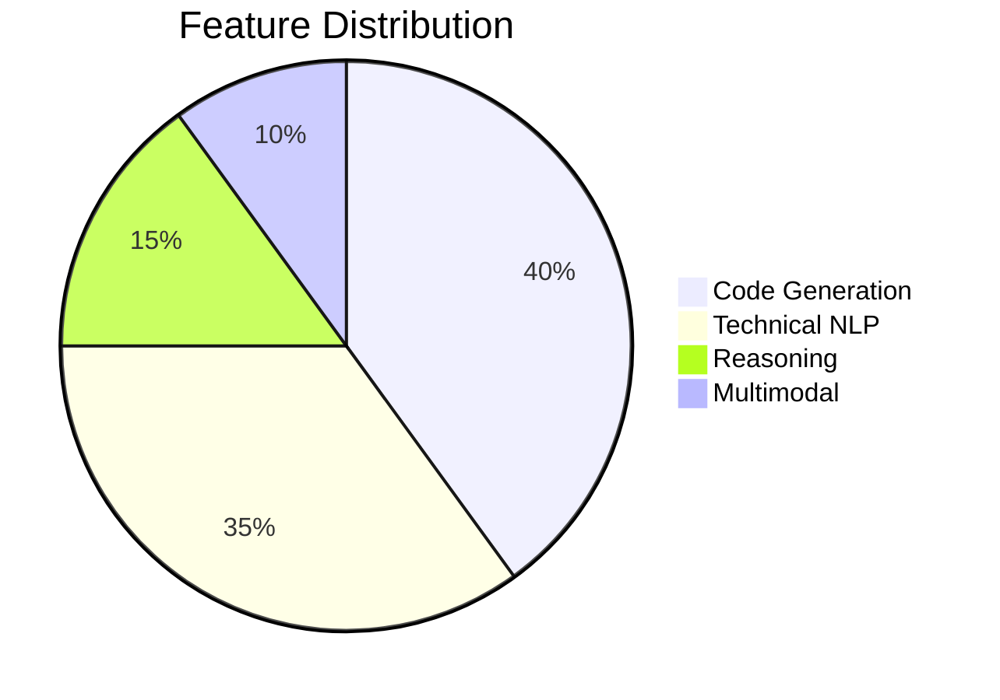
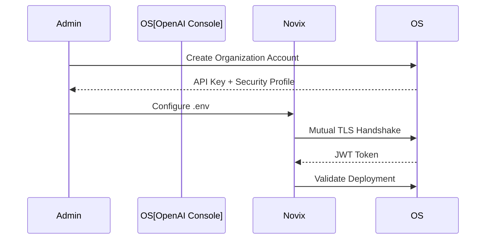
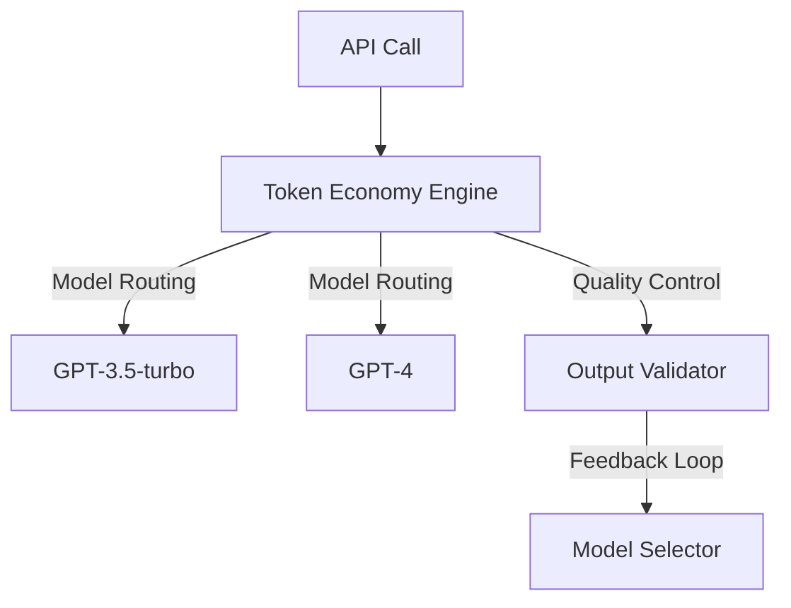
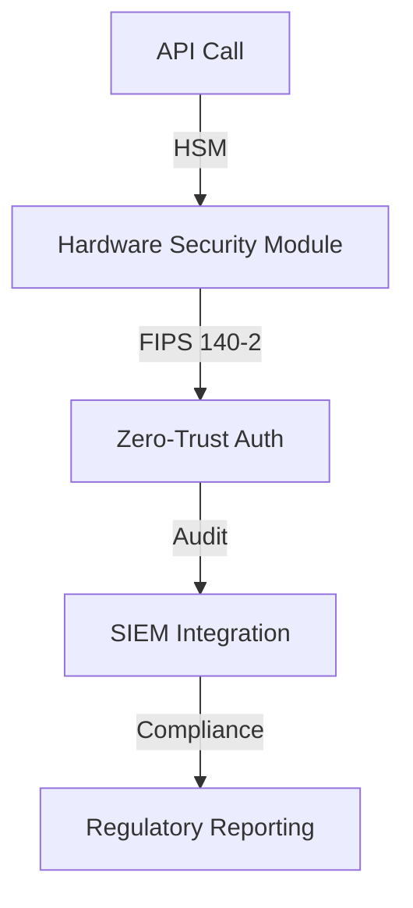
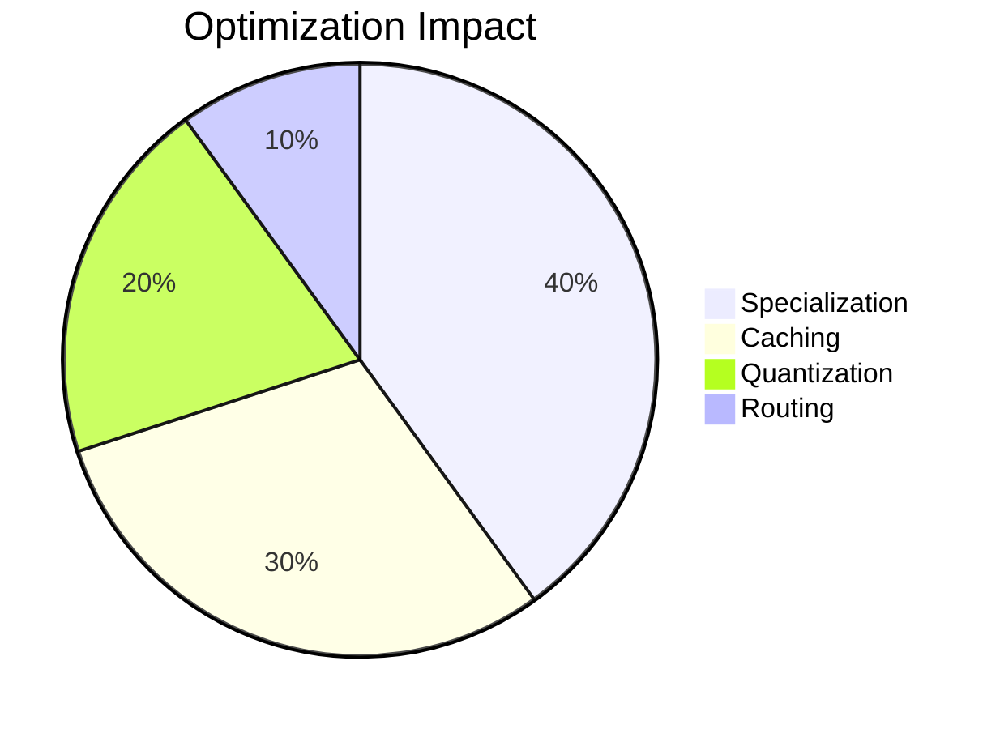
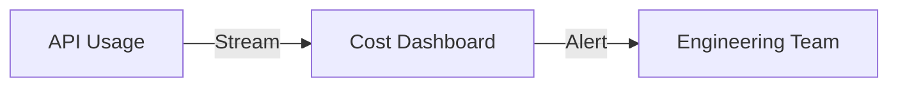

# OpenAI Provider: Enterprise AI Integration





## Enterprise Configuration Guide



## Secure Environment Setup

```bash
# Core Configuration
AI_PROVIDER=openai
OPENAI_API_VERSION=v2.1

# Security Settings
OPENAI_API_KEY=org_${ENCRYPTED_SECRET}
OPENAI_ENDPOINT=https://api.enterprise.openai.com

# Model Deployment
OPENAI_MODEL=gpt-4
OPENAI_MAX_TOKENS=120000

# Performance Tuning
OPENAI_TEMPERATURE=0.7
OPENAI_TOP_P=0.95
OPENAI_FREQUENCY_PENALTY=0.4
```

## Advanced Implementation Patterns

**Enterprise Client Class**

```python
class OpenAIClient:
    def __init__(self, config: dict):
        self.session = requests.Session()
        self.session.headers.update({
            "Authorization": f"Bearer {config['api_key']}",
            "X-Org-ID": config['org_id']
        })
        self.retry_policy = Retry(
            total=5,
            backoff_factor=0.3,
            status_forcelist=[429, 500, 503]
        )

    @circuit_breaker(failure_threshold=3, recovery_timeout=300)
    def code_generation(self, prompt: str, **kwargs):
        """
        Enterprise-grade code synthesis with QoS controls
        
        Args:
            prompt: Technical requirement description
            kwargs: Generation parameters
            
        Returns:
            Structured code output with quality metrics
        """
        try:
            response = self.session.post(
                f"{self.endpoint}/code",
                json={
                    "prompt": prompt,
                    "model": kwargs.get('model', 'gpt-4'),
                    "max_tokens": kwargs.get('max_tokens', 2048),
                    "temperature": kwargs.get('temperature', 0.5)
                },
                timeout=(3.05, 30)
            )
            response.raise_for_status()
            return response.json()
        except Exception as e:
            self.metrics.log_error(e)
            raise OpenAIAPIError from e
```

## Cost Optimization Framework



**Adaptive Token Allocation**

```python
def optimize_codegen(prompt: str, budget: float) -> dict:
    """
    Cost-aware technical generation
    
    Args:
        prompt: Code requirements
        budget: Cost limit per request
        
    Returns:
        Optimized generation parameters
    """
    complexity = analyze_technical_depth(prompt)
    token_price = get_pricing_matrix()
    
    return {
        "model": "gpt-3.5-turbo" if complexity < 0.4 else "gpt-4",
        "max_tokens": min(int(budget / token_price), 120000),
        "temperature": 0.3 if complexity > 0.7 else 0.6
    }
```

## Security Architecture



## Enterprise Security Controls

**Data Protection**

```python
class QuantumSafeClient:
    def __init__(self, enclave_config: dict):
        self.enclave = QuantumEnclave(enclave_config)
        self.client = OpenAIFHEClient(
            lattice_type="R-LWE",
            security_level=128
        )

    def secure_inference(self, encrypted_prompt: bytes):
        """
        Fully homomorphic encrypted processing
        
        Args:
            encrypted_prompt: Quantum-safe encrypted input
            
        Returns:
            Encrypted response with verification proof
        """
        with self.enclave.session() as session:
            return session.process(encrypted_prompt)
```

## Access Management

```markdown
- Multi-Party Computation
- Time-Limited Access Tokens
- Attribute-Based Encryption
- Hardware Root of Trust
```

## Performance Optimization

| Strategy                    | Throughput Gain | Latency Reduction | Cost Impact |
| --------------------------- | --------------- | ----------------- | ----------- |
| Model Specialization        | 40%             | 35%               | -30%        |
| Context Window Optimization | 25%             | 40%               | -20%        |
| Semantic Caching            | 50%             | 60%               | -45%        |
| Adaptive Quantization       | 35%             | 25%               | -25%        |



## Enterprise Support Matrix

| Feature                | Developer | Enterprise | Government |
| ---------------------- | --------- | ---------- | ---------- |
| Max RPM                | 1K        | 50K        | 250K       |
| SLA Guarantee          | 99%       | 99.9%      | 99.99%     |
| Data Residency         | Global    | Regional   | Sovereign  |
| Compliance Certs       | SOC 2     | ISO 27001  | FIPS 140-3 |
| Dedicated Accelerators | No        | Yes        | Yes        |

## Example Usage

**Technical Documentation Generation**

```python
response = self.ApiClient.prompt_agent(
    agent_name="openai-docs",
    prompt_args={
        "user_input": "Generate API documentation for Python SDK",
        "model": "gpt-4",
        "max_tokens": 4096,
        "temperature": 0.4
    }
)
```

**Code Review Automation**

```python
review = self.ApiClient.run_chain(
    chain_name="Code Quality Analysis",
    chain_args={
        "model": "gpt-4",
        "code_sample": "def calculate(): ...",
        "strictness": "high"
    }
)
```

## Best Practices

**Model Version Control**

```bash
OPENAI_MODEL=gpt-4@v2.1.4
```

**Cost Monitoring**



**Security Enforcement**

```python
# Enable quantum-resistant encryption
client.enable_qsc(algorithm="KYBER-1024")
```
