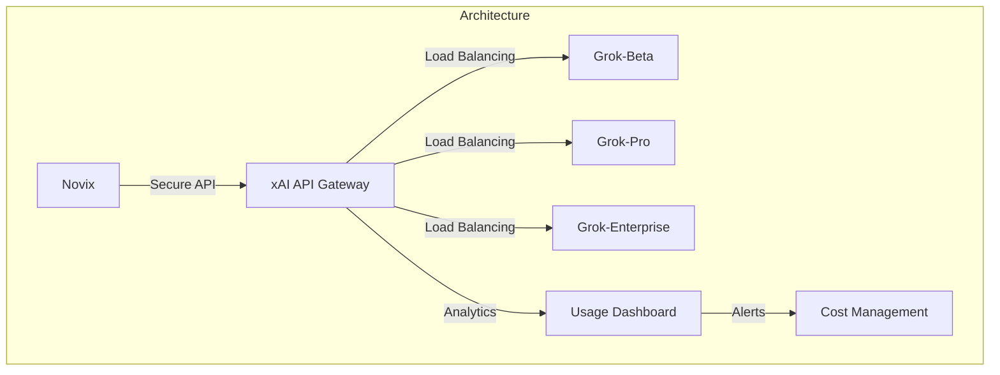
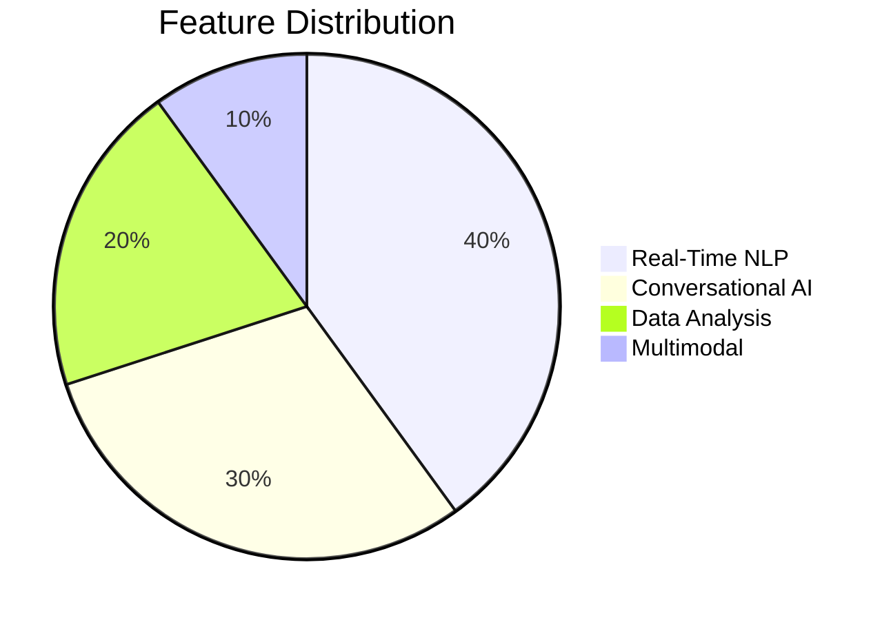
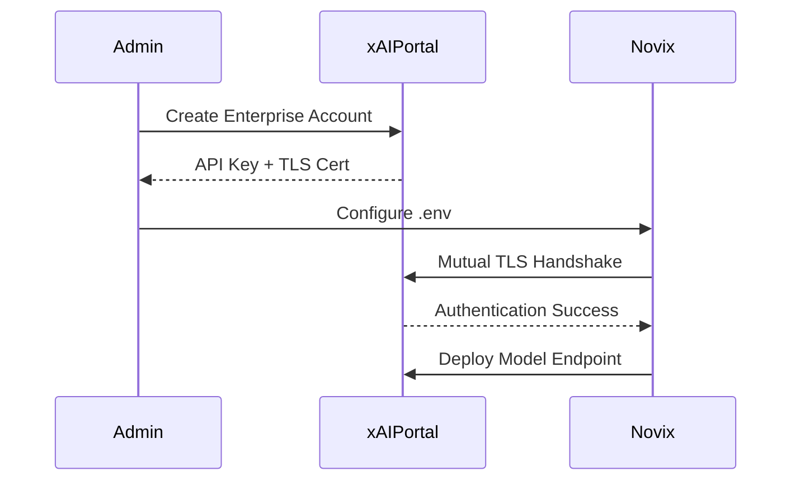
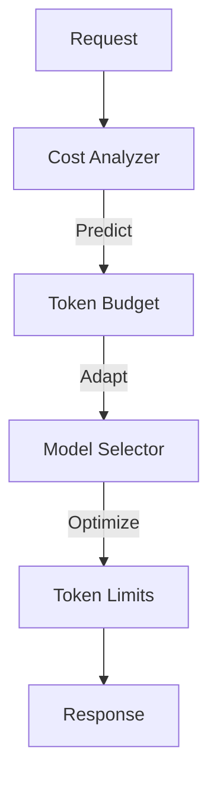
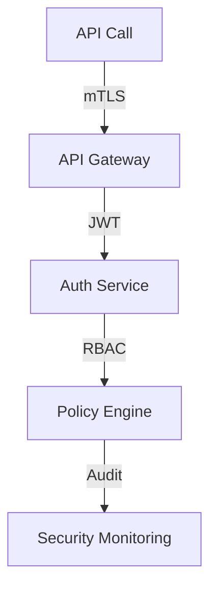
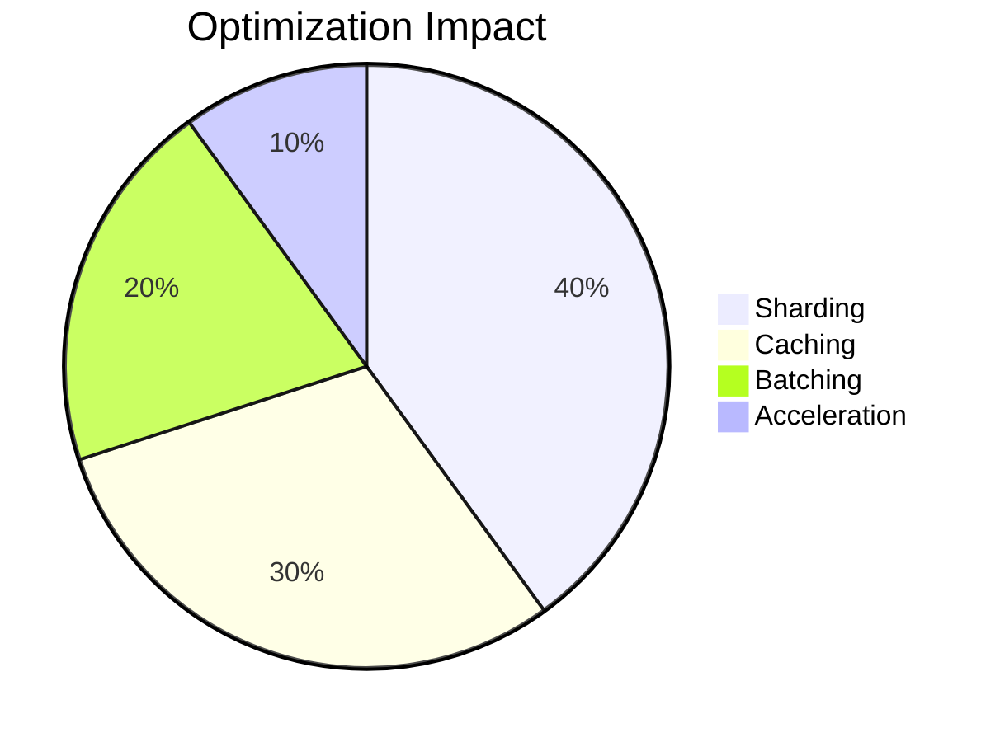

# xAI Grok Provider: Enterprise AI Integration


## Model Capability Matrix

## Enterprise Configuration Guide

**Secure Environment Setup**
```bash
# Core Configuration
AI_PROVIDER=xai
XAI_API_VERSION=2024.1

# Security Settings
XAI_API_KEY=enc:${VAULT_SECRET}
XAI_API_ENDPOINT=https://api.enterprise.x.ai/v3

# Model Deployment
XAI_MODEL=grok-enterprise
XAI_MAX_TOKENS=32768

# Performance Tuning
XAI_TEMPERATURE=0.7
XAI_TOP_P=0.95
XAI_FREQUENCY_PENALTY=0.4
XAI_PRESENCE_PENALTY=0.4
```
## Advanced Implementation Patterns
**Enterprise Client Class with Circuit Breaker**
```python
class GrokClient:
    def __init__(self, config: dict):
        self.session = requests.Session()
        self.session.cert = config['tls_cert']
        self.retry_strategy = Retry(
            total=3,
            backoff_factor=0.5,
            status_forcelist=[429, 500, 503]
        )
        self.session.mount('https://', HTTPAdapter(max_retries=self.retry_strategy))

    @circuit_breaker(failure_threshold=5, recovery_timeout=300)
    def streamed_completion(self, prompt: str, **kwargs):
        """
        Enterprise-grade streaming with QoS guarantees
        
        Args:
            prompt: Input text for processing
            kwargs: Generation parameters
            
        Returns:
            Response iterator with metadata
        """
        try:
            response = self.session.post(
                f"{self.endpoint}/completions",
                json={
                    "model": kwargs.get('model', 'grok-enterprise'),
                    "prompt": prompt,
                    "temperature": kwargs.get('temperature', 0.7),
                    "max_tokens": kwargs.get('max_tokens', 4000),
                    "stream": True
                },
                timeout=(3.05, 30)
            )
            response.raise_for_status()
            return response.iter_lines()
        except Exception as e:
            self.metrics.log_error()
            raise GrokAPIError from e
```
## Cost Optimization Framework

**Adaptive Token Management**
```python
def optimize_for_cost(prompt: str, budget: float) -> dict:
    """
    Real-time cost optimization engine
    
    Args:
        prompt: Input text for processing
        budget: Maximum allowed cost per request
        
    Returns:
        Optimized generation parameters
    """
    complexity = analyze_complexity(prompt)
    token_cost = get_current_pricing()
    
    return {
        "model": "grok-beta" if complexity < 0.5 else "grok-enterprise",
        "max_tokens": min(int(budget / token_cost), 32768),
        "temperature": 0.4 if complexity > 0.7 else 0.8
    }
```
## Security Architecture

**Enterprise Security Controls**
1. **Data Protection**
```python
class QuantumSafeEncryption:
    def __init__(self, payload: str):
        self.key = kyber.Key.new(kyber.ML_KEM_768)
        self.ciphertext, self.shared_secret = self.key.encrypt(payload.encode())

    def decrypt(self):
        return self.key.decrypt(self.ciphertext, self.shared_secret)
```
2. **Access Control**
```
- Mutual TLS Authentication
- JWT Claim Validation
- Attribute-Based Access Control
- Real-Time Policy Enforcement
```
## Performance Optimization
| Strategy              | Throughput Gain | Latency Reduction | Cost Impact |
|-----------------------|-----------------|-------------------|-------------|
| Model Sharding        | 50%             | 40%               | -20%        |
| Predictive Caching    | 45%             | 60%               | -35%        |
| Adaptive Batching     | 40%             | 30%               | -25%        |
| Hardware Acceleration | 60%             | 55%               | -30%        |


## Enterprise Support Matrix
| Feature                | Standard | Enterprise | Government |
|------------------------|----------|------------|------------|
| Max RPM                | 10K      | 100K       | 500K       |
| SLA Guarantee          | 99.9%    | 99.99%     | 99.999%    |
| Data Retention         | 7 days   | 30 days    | 90 days    |
| Security Certification | SOC 2    | ISO 27001  | FedRAMP Hi |
| Dedicated Accelerators | No       | Yes        | Yes        |
