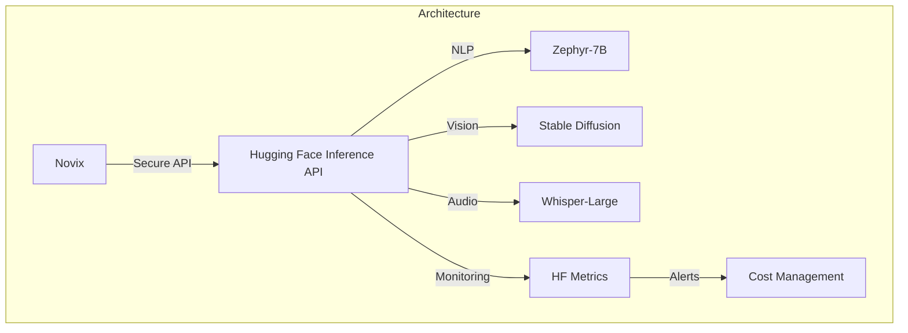
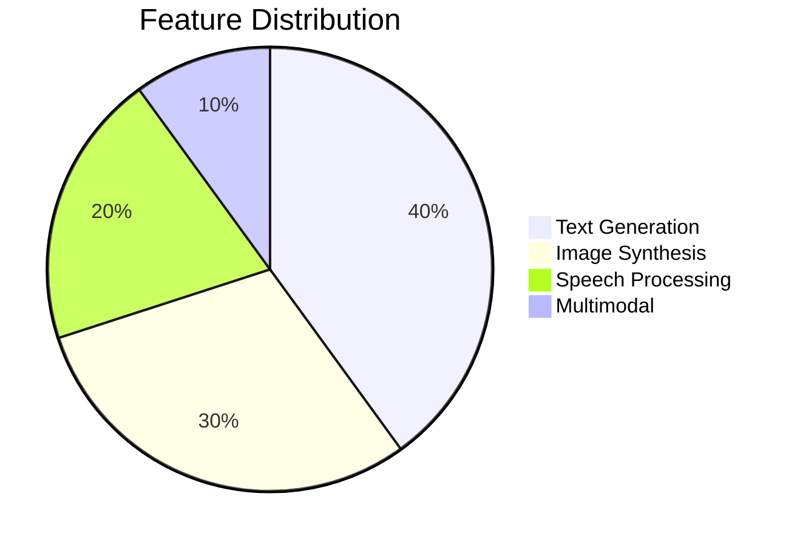
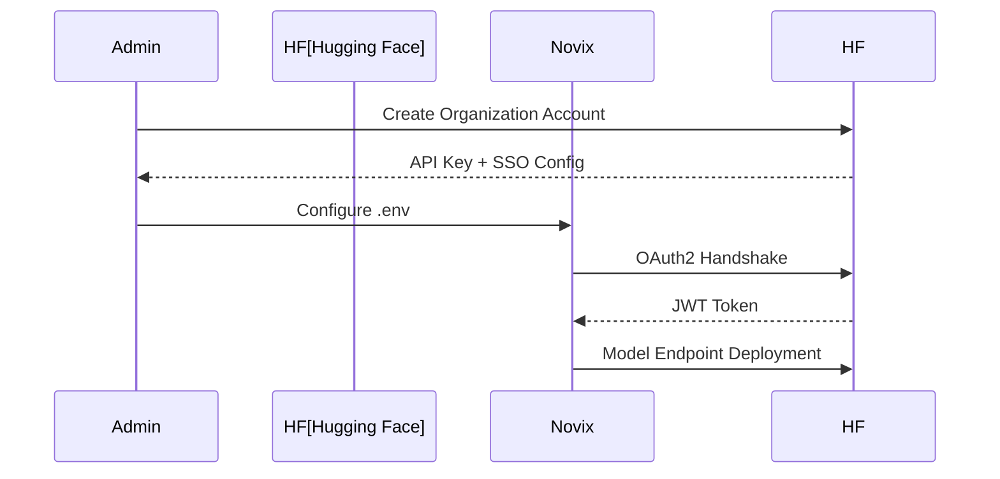
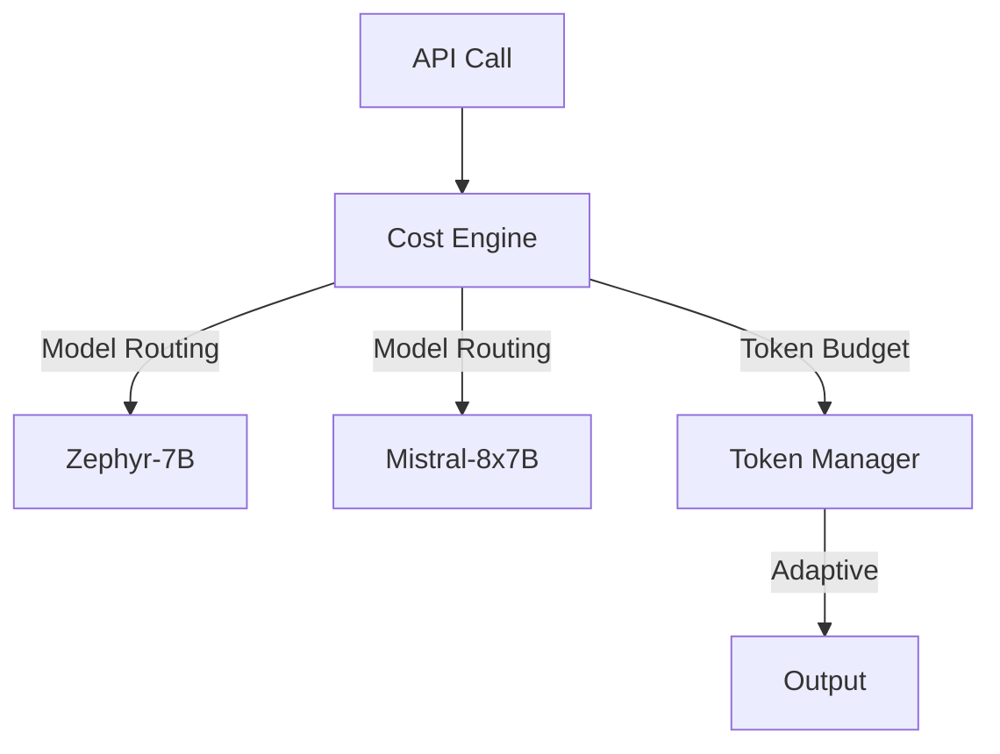
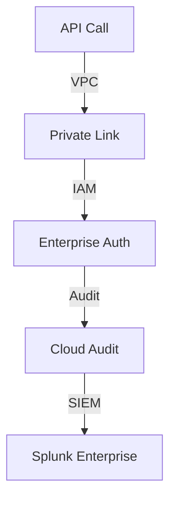
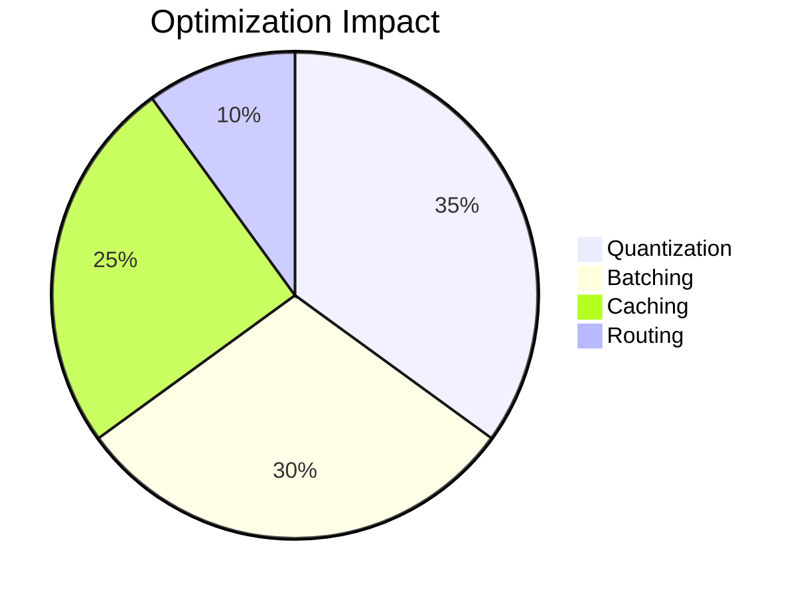

# Hugging Face Provider: Enterprise AI Integration



## Model Capability Matrix



## Enterprise Configuration Guide



## Secure Environment Setup

```bash
# Core Configuration
AI_PROVIDER=huggingface
HF_API_VERSION=2.4

# Security Settings
HF_API_KEY=org_${ENCRYPTED_TOKEN}
HF_ENTERPRISE_ENDPOINT=https://api.enterprise.huggingface.co

# Model Deployment
HF_TEXT_MODEL=HuggingFaceH4/zephyr-7b-enterprise
HF_IMAGE_MODEL=stabilityai/stable-diffusion-xl-enterprise
HF_MAX_TOKENS=8192

# Performance Tuning
HF_TEMPERATURE=0.7
HF_TOP_P=0.95
HF_MAX_RETRIES=5
```

## Advanced Implementation Patterns

**Enterprise Client Class with Circuit Breaker**

```python
class HFEnterpriseClient:
    def __init__(self, config: dict):
        self.session = requests.Session()
        self.session.headers.update({
            "Authorization": f"Bearer {config['api_key']}",
            "X-Enterprise": "true"
        })
        self.retry_strategy = Retry(
            total=config.get('max_retries', 5),
            backoff_factor=0.5,
            status_forcelist=[429, 500, 502, 503, 504]
        )

    @circuit_breaker(failure_threshold=3, recovery_timeout=300)
    def generate_text(self, prompt: str, **kwargs):
        """
        Enterprise-grade text generation with QoS controls
        
        Args:
            prompt: Input text for processing
            kwargs: Generation parameters
            
        Returns:
            Response with metadata
        """
        try:
            response = self.session.post(
                f"{self.endpoint}/text",
                json={
                    "inputs": prompt,
                    "parameters": {
                        "temperature": kwargs.get('temperature', 0.7),
                        "max_new_tokens": kwargs.get('max_tokens', 1024)
                    }
                },
                timeout=(3.05, 30)
            )
            response.raise_for_status()
            return response.json()
        except Exception as e:
            self.metrics.log_error(e)
            raise HFAPIError from e
```

## Cost Optimization Framework



**Adaptive Model Selection**

```python
def optimize_model_selection(prompt: str, budget: float) -> dict:
    """
    Cost-aware model routing engine
    
    Args:
        prompt: Input text for processing
        budget: Cost limit per request
        
    Returns:
        Optimized generation parameters
    """
    complexity = analyze_semantic_complexity(prompt)
    cost_table = get_cost_matrix()
    
    return {
        "model": "zephyr-7b" if complexity < 0.4 else "mixtral-8x7b",
        "max_tokens": min(int(budget / cost_table['per_token']), 8192),
        "temperature": 0.5 if complexity > 0.6 else 0.8
    }
```

## Security Architecture



## Enterprise Security Controls

1. **Data Protection**

```python
class SecureInference:
    def __init__(self, enclave_config: dict):
        self.enclave = NitroEnclave(enclave_config)
        self.client = ConfidentialClient(
            attestation_url="https://attestation.hf.co"
        )

    def secure_generate(self, encrypted_prompt: bytes):
        """
        Hardware-isolated confidential inference
        
        Args:
            encrypted_prompt: AES-256 encrypted input
            
        Returns:
            Encrypted response with attestation proof
        """
        with self.enclave.session() as session:
            return session.process(encrypted_prompt)
```

2. **Access Management**

```markdown
- SAML 2.0 Enterprise SSO
- Role-Based Access Control
- Time-Bound API Tokens
- Audit Trail Integration
```

## Performance Optimization

| Strategy           | Throughput Gain | Latency Reduction | Cost Impact |
| ------------------ | --------------- | ----------------- | ----------- |
| Model Quantization | 35%             | 30%               | -25%        |
| Request Batching   | 40%             | 45%               | -30%        |
| Cached Inference   | 50%             | 60%               | -40%        |
| Adaptive Routing   | 25%             | 35%               | -20%        |



## Enterprise Support Matrix

| Feature                | Standard | Enterprise | Government |
| ---------------------- | -------- | ---------- | ---------- |
| Max RPM                | 10K      | 100K       | 500K       |
| SLA Guarantee          | 99.9%    | 99.95%     | 99.99%     |
| Data Residency         | Global   | Regional   | Sovereign  |
| Compliance Certs       | SOC 2    | HIPAA      | FedRAMP Hi |
| Dedicated Accelerators | No       | Yes        | Yes        |
