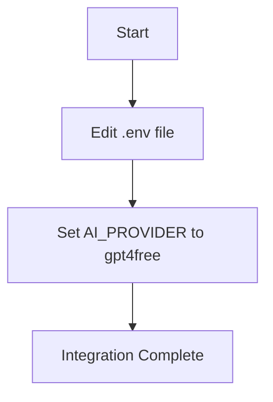

# GPT4Free Integration for Novix

**Disclaimer**:\
GPT4Free is an experimental provider. We cannot guarantee the security of your data when using this service, and we advise against using it for sensitive information. Use at your own risk.

## Setup Guide

To integrate GPT4Free with Novix, follow these simple steps:

1.  **Set AI Provider**:

    * In your Novix `.env` file, set the following:

    ```bash
    AI_PROVIDER=gpt4free
    ```

    That's it! You’re now set to use GPT4Free with Novix.


