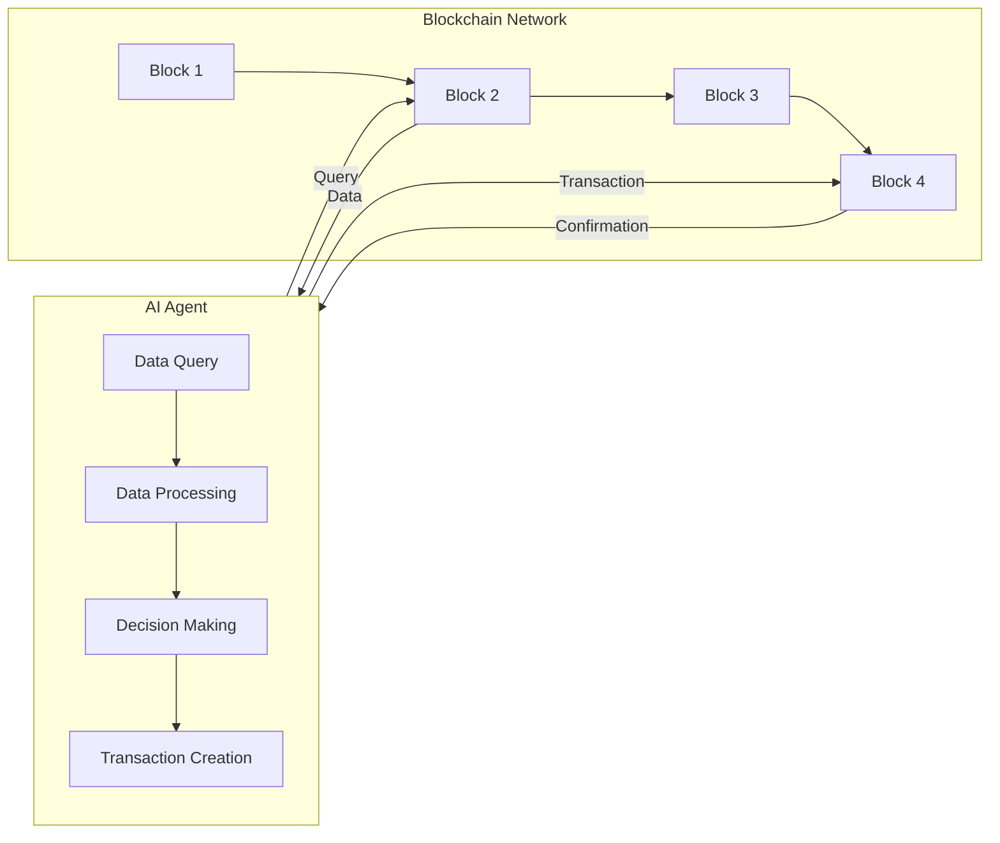

# Blockchain Integrations

Blockchain technology offers decentralized, secure, and transparent solutions that can be synergized with AI automation. By integrating blockchains like Solana into Novix, users can leverage AI to automate interactions with decentralized applications (dApps), manage digital assets, and analyze on-chain data in real-time.

## Why Blockchain Integrations?

Integrating blockchains with Novix enhances its capabilities by enabling AI agents to interact with decentralized systems, such as monitoring token prices, executing trades, and providing liquidity to decentralized exchanges (DEXs). This opens up new possibilities for AI-driven blockchain applications, enhancing both the capabilities of Novix and the utility of blockchain ecosystems.

## Focus on Solana

Solana is our primary blockchain integration due to its high performance, supporting thousands of transactions per second with low fees. See [Solana Integration](solana-integration.md) for detailed setup and usage.

## Expanding to Other Blockchains

Novix is designed to be extensible, allowing integration with other blockchains like Ethereum, Binance Smart Chain, or Polygon. Each blockchain has unique characteristics, and we encourage the community to contribute new integrations. For guidelines, see [Other Blockchains](other-blockchains.md).

