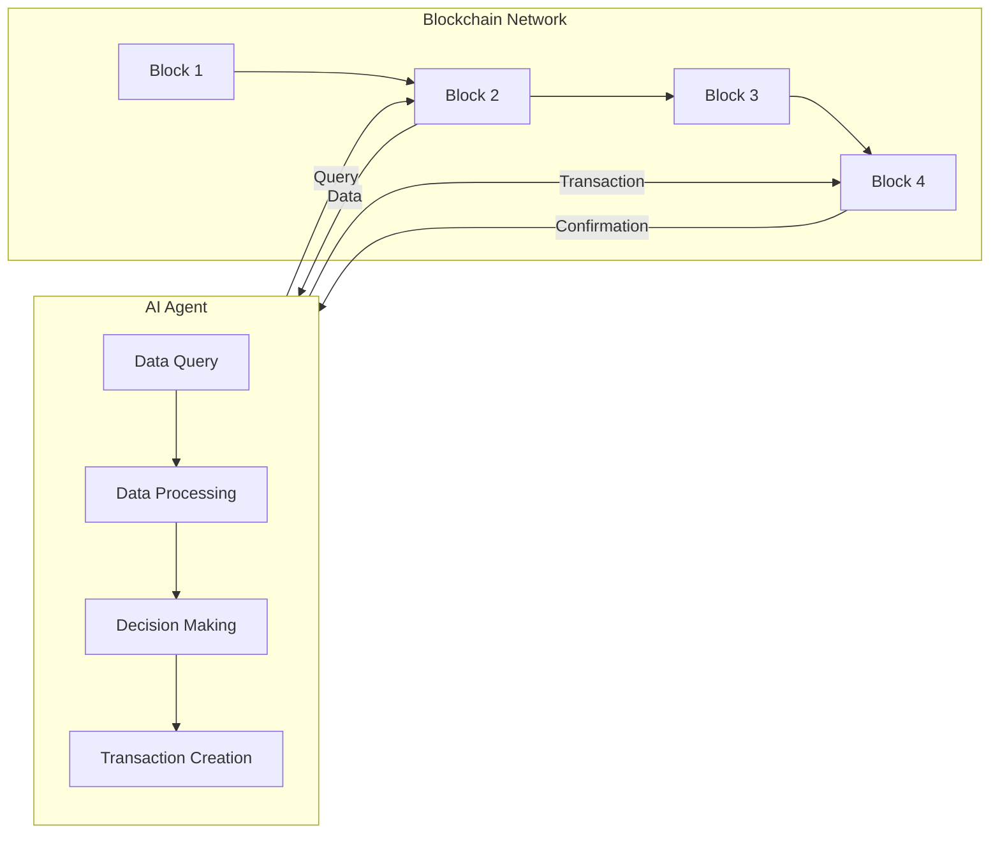
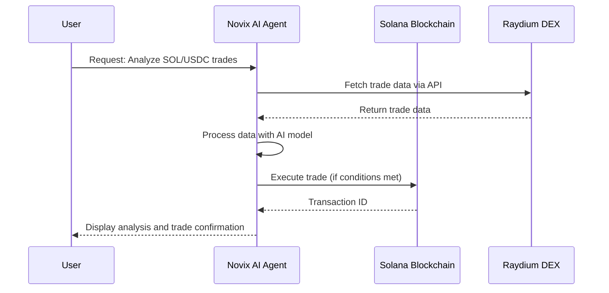

# Blockchain Integration

Novix seamlessly integrates with blockchain networks, enabling AI-driven automation for decentralized applications (dApps), digital asset management, and on-chain data analysis. Our primary integration is with Solana, a high-performance blockchain known for its fast transaction speeds and low fees, making it ideal for AI-driven applications requiring high throughput. We also provide guidelines for expanding to other blockchains like Ethereum and Polygon.

## Why Blockchain Integration?

By combining Novix’s AI capabilities with blockchain technology, users can:
- **Automate Financial Operations**: Monitor token prices, execute trades, and manage liquidity pools in real-time.
- **Analyze On-Chain Data**: Use AI to identify trends, anomalies, and patterns in blockchain transactions.
- **Build Scalable dApps**: Develop decentralized applications with AI-driven logic, leveraging Novix’s extensible plugin system.
- **Enhance Transparency**: Leverage blockchain’s decentralized nature for secure, auditable workflows.

## Solana Integration

Solana is a high-performance blockchain known for its fast transaction speeds (thousands of transactions per second) and low fees, making it ideal for AI-driven applications requiring high throughput.

### Setting Up Solana

To integrate Solana with Novix, install the necessary libraries and configure your environment.

#### Installation

Install the `solana-py` library for interacting with Solana:

```bash
pip install solana
```
**Configuration**

Connect to a Solana RPC endpoint. For development, use the Devnet:
```python

from solana.rpc.api import Client

client = Client("[invalid url, do not cite])
```
For production, use the Mainnet endpoint:
```python

client = Client("[invalid url, do not cite])
```
**Managing Wallet Keys**

Securely manage private keys using environment variables or a secure vault. Use python-dotenv for easier management:
```bash

pip install python-dotenv
````
Create a .env file with SOLANA_PRIVATE_KEY=your_private_key_here (never commit to version control). Then:
```python

from dotenv import load_dotenv
import os
from solana.keypair import Keypair

load_dotenv()
private_key = os.getenv("SOLANA_PRIVATE_KEY")
keypair = Keypair.from_secret_key(bytes.fromhex(private_key))
```
**Warning:** Never hardcode private keys. Consider using multi-signature wallets for production.
### Basic Operations
**Checking Balances**

Check the balance of a Solana account, handling errors:
```python

from solana.publickey import PublicKey

public_key = PublicKey("your_public_key_here")
try:
    balance = client.get_balance(public_key)
    print(f"Balance: {balance['result']['value'] / 1e9} SOL")
except Exception as e:
    print(f"Error checking balance: {e}")
```
**Sending Transactions**

Send SOL to another account, with error handling:
```python

from solana.transaction import Transaction
from solana.system_program import transfer, TransferParams

transaction = Transaction().add(
    transfer(
        TransferParams(
            from_pubkey=keypair.public_key,
            to_pubkey=PublicKey("recipient_public_key_here"),
            lamports=1000000,  # 0.001 SOL
        )
    )
)

try:
    response = client.send_transaction(transaction, keypair)
    if 'result' in response:
        print(f"Transaction successful: {response['result']}")
    else:
        print(f"Transaction failed: {response['error']}")
except Exception as e:
    print(f"An error occurred: {e}")
```
### Interacting with Decentralized Exchanges (DEXs)
Novix supports interactions with leading Solana DEXs, enabling AI-driven trading and liquidity management.

**Raydium**

Fetch token prices from Raydium’s API, with error handling:
```python

import requests

def get_raydium_token_price(token_mint):
    url = "[invalid url, do not cite]
    try:
        response = requests.get(url, params={"token": token_mint}, timeout=10)
        if response.status_code == 200:
            return response.json().get("price", "Price not found")
        else:
            return "Failed to fetch prices"
    except requests.exceptions.RequestException as e:
        return f"Error: {e}"

# Example: Fetch SOL price
sol_mint = "So11111111111111111111111111111111111111112"
sol_price = get_raydium_token_price(sol_mint)
print(f"SOL price: {sol_price}")
```
For trading, refer to the Raydium SDK for detailed implementations.

**Pump.fun**

Access token data via PumpPortal’s API, subject to change:
```python

import requests

def get_pump_fun_token_data(token_address):
    url = f"https://api.pumpportal.fun/data?token={token_address}"
    try:
        response = requests.get(url, timeout=10)
        return response.json()
    except requests.exceptions.RequestException as e:
        return {"error": str(e)}

# Example usage
token_data = get_pump_fun_token_data("your_token_address_here")
print(token_data)
```
See the PumpPortal Documentation for details.

**Meteora**

Interact with Meteora’s Dynamic Liquidity Market Maker (DLMM) pools:
```python

from solana.transaction import Transaction
from solana.publickey import PublicKey

# Example: Add liquidity to a Meteora pool (simplified)
pool_address = PublicKey("meteora_pool_address")
# Define the instruction based on Meteora's documentation
instruction = ...  # Specific to Meteora
transaction = Transaction().add(instruction)
try:
    response = client.send_transaction(transaction, keypair)
    print(f"Transaction ID: {response['result']}")
except Exception as e:
    print(f"Error: {e}")
```
For full details, consult the Meteora Documentation.
## Advanced Use Cases
**AI-Driven Trading Strategies**

Use Novix’s AI to create trading bots that analyze market data and execute trades.

**Example: Predicting Price Movements**

Create an AI agent to predict SOL price movements and trade accordingly:
```python

from novix.ai import AIAgent
import requests

def get_recent_trades(pair, limit=100):
    url = f"https://api.raydium.io/trades?pair={pair}&limit={limit}"
    response = requests.get(url)
    if response.status_code == 200:
        return response.json()
    else:
        return []

agent = AIAgent(model="gpt-4")
trades = get_recent_trades("SOL/USDC")
analysis = agent.analyze(trades, prompt="Based on recent trades, will SOL price go up or down in the next hour? Provide 'up' or 'down'.")
prediction = analysis.get("prediction", "unknown")

if prediction == "up":
    # Execute buy order (simplified)
    transaction = Transaction().add(
        # Raydium-specific instruction for buying
    )
    try:
        response = client.send_transaction(transaction, keypair)
        print(f"Bought SOL, Transaction ID: {response['result']}")
    except Exception as e:
        print(f"Error buying SOL: {e}")
elif prediction == "down":
    # Execute sell order (simplified)
    transaction = Transaction().add(
        # Raydium-specific instruction for selling
    )
    try:
        response = client.send_transaction(transaction, keypair)
        print(f"Sold SOL, Transaction ID: {response['result']}")
    except Exception as e:
        print(f"Error selling SOL: {e}")
else:
    print("No clear prediction; holding position.")
```
**Note:** This is a simplified example; actual trading involves more complex instructions specific to the DEX. Refer to the Raydium SDK for details.

**Automated Liquidity Provision**

Configure AI agents to manage liquidity pools on Meteora or Raydium based on market analysis:
```python

agent = AIAgent(model="claude-3")
pool_data = get_meteora_pool_data("pool_address")  # Function to fetch pool data
analysis = agent.analyze(pool_data, prompt="Optimize liquidity provision for SOL/USDC pool")
if analysis["action"] == "add_liquidity":
    # Add liquidity (simplified)
    transaction = Transaction().add(
        # Meteora-specific instruction for adding liquidity
    )
    try:
        response = client.send_transaction(transaction, keypair)
        print(f"Added liquidity, Transaction ID: {response['result']}")
    except Exception as e:
        print(f"Error adding liquidity: {e}")
```
### Security Best Practices
**Private Key Management:** Use environment variables or secure vaults. Never hardcode keys.

**Transaction Verification:** Always verify transaction details before signing.

**Rate Limiting:** Implement exponential backoff for API retries to handle rate limits.

**Error Handling:** Use try-catch blocks to manage network failures and other exceptions.

**Data Encryption:** Ensure all data transmissions are over HTTPS and sensitive data is encrypted at rest.

### Expanding to Other Blockchains
Novix’s extensible plugin system supports additional blockchains. For example, to integrate with Ethereum:
Install web3.py:

```bash

pip install web3
```
Connect to an Ethereum RPC endpoint:

```python

from web3 import Web3

w3 = Web3(Web3.HTTPProvider("[invalid url, do not cite]))
```
Manage Ethereum wallet keys similarly to Solana.

For more details, see the Ethereum Documentation.
## API Documentation
Novix provides RESTful API endpoints for blockchain operations:

`GET /v1/blockchain/solana/trades:` Fetch recent trades from a specified DEX.

**Parameters:** dex, pair, limit

**Example:** curl -H "Authorization: Bearer <your-api-key>" -G "[invalid url, do not cite] -d "dex=Raydium" -d "pair=SOL/USDC" -d "limit=50"

**Response:** JSON array of trades with timestamp, price, amount, side.

`POST /v1/ai/blockchain/analyze:` Analyze blockchain data with AI.

**Parameters:** data, model, prompt

**Example:** `curl -X POST -H "Authorization: Bearer <your-api-key>" -H "Content-Type: application/json" -d '{"data": {"trades": [...]}, "model": "gpt-4", "prompt": "Identify trading patterns"}' "[invalid url, do not cite]

**Response:** JSON with analysis results.

See API Reference (#api-reference) for more.
### Tutorials
### Building an AI-Powered Trading Bot
Set up your environment: Install necessary libraries and configure RPC endpoints.

Create a wallet: Generate a keypair and fund it with SOL on Devnet.

Fetch market data: Use Raydium API to get recent trades for a specific pair.

Analyze with AI: Use Novix’s AIAgent to predict price movements based on trade data.

Execute trades: Send transactions to buy or sell based on the prediction.

For a full guide, see Tutorials (#Novix/tutorials).
### Scalability Considerations
Blockchain networks like Solana are designed for high throughput, but integrating AI with blockchain can introduce additional challenges. Novix addresses these through:
Efficient Data Processing: Using AI to process and analyze blockchain data in real-time without overloading the network.

Optimized Transaction Handling: Implementing smart transaction management to reduce latency and improve throughput.

Scalable Architecture: Designing the system to handle increasing numbers of users and transactions, possibly using techniques like sharding or layer-2 solutions.

For more details, refer to our Scalability Whitepaper (#Novix/scalability-whitepaper).
### Workflow Example
Below is a sequence diagram illustrating how a Novix AI agent interacts with Solana for trade monitoring and execution:

