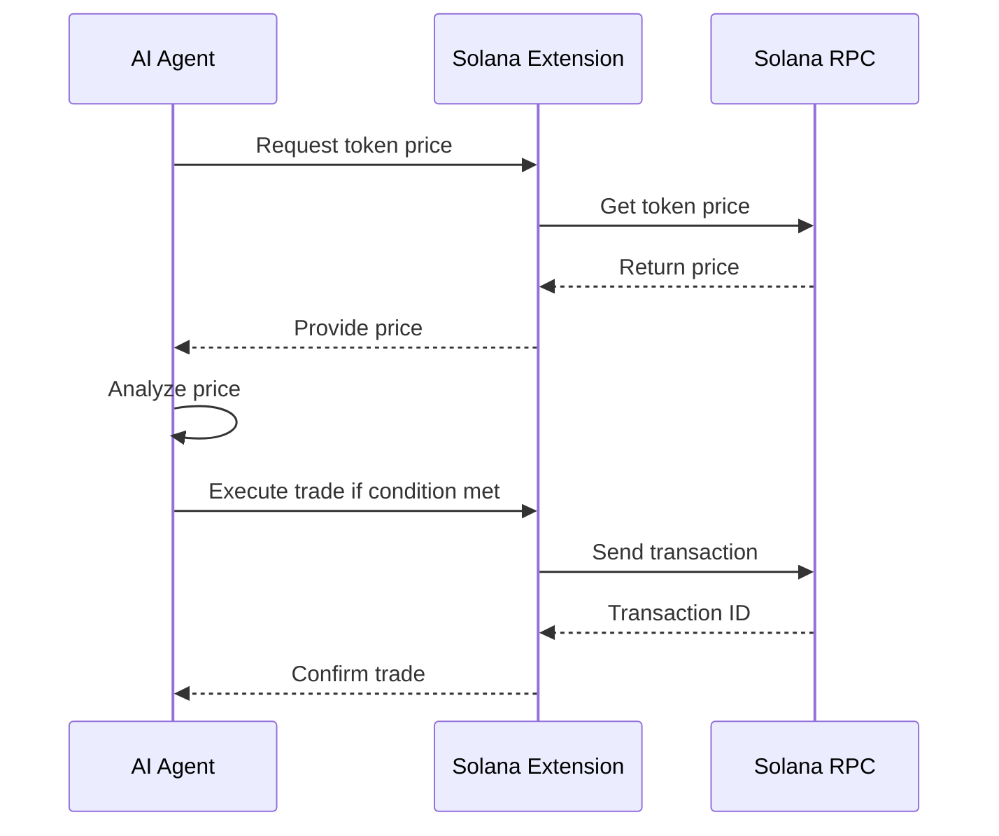

# Solana Integration

## Introduction

Solana is a high-performance blockchain platform designed for decentralized applications and cryptocurrencies. It is known for its fast transaction speeds and low fees, making it ideal for applications that require high throughput and scalability. By integrating Solana with Novix, users can leverage the power of AI to automate interactions with the Solana blockchain, such as monitoring token prices, executing trades, and analyzing on-chain data.

## Setting Up Solana in Novix

To integrate Solana with Novix, you'll need to install the necessary libraries and configure your environment.

### Installation

First, install the `solana` Python library, which provides a convenient way to interact with the Solana blockchain.

```bash
pip install solana
```

### Configuration

Set up a connection to a Solana RPC endpoint. For development, use the Devnet.

```python

from solana.rpc.api import Client

client = Client("[invalid url, do not cite])
```

For production, use the Mainnet endpoint.

```python

client = Client("[invalid url, do not cite])
```

### Managing Wallet Keys

Securely manage your wallet's private keys using environment variables or a secure vault. Here's an example using environment variables:

```python

import os
from solana.keypair import Keypair

private_key = os.getenv("SOLANA_PRIVATE_KEY")
keypair = Keypair.from_secret_key(bytes.fromhex(private_key))
```

Never hardcode private keys in your code.

## Interacting with Solana

### Basic Operations

**Checking Balances**\
Check the balance of a Solana account:

```python

from solana.publickey import PublicKey

public_key = PublicKey("your_public_key_here")
balance = client.get_balance(public_key)
print(f"Balance: {balance['result']['value'] / 1e9} SOL")
```

**Sending Transactions**\
Send SOL from one account to another:

```python

from solana.transaction import Transaction
from solana.system_program import transfer, TransferParams

transaction = Transaction().add(
    transfer(
        TransferParams(
            from_pubkey=keypair.public_key,
            to_pubkey=PublicKey("recipient_public_key_here"),
            lamports=1000000,  # 0.001 SOL
        )
    )
)

response = client.send_transaction(transaction, keypair)
print(f"Transaction ID: {response['result']}")
```

## Interacting with DEXs

**Raydium**\
Raydium is a leading DEX on Solana. You can fetch token prices using their API.

```python

import requests

def get_raydium_token_price(token_mint):
    url = "https://quote-api.huobi.com/v1/spot/quote?symbol=SOL-USDT"
    response = requests.get(url)
    prices = response.json()
    return prices.get(token_mint, "Price not found")

# Example usage
sol_price = get_raydium_token_price("So11111111111111111111111111111111111111112")  # SOL mint address
print(f"SOL price: {sol_price}")
```

For more advanced interactions, refer to the [Raydium Documentation](https://docs.raydium.io/raydium/traders/trade-api).

**Pump.fun**\
Pump.fun provides PumpSwap, an AMM for tokens launched on their platform. Use third-party APIs like PumpPortal for data access.

```python

import requests

def get_pump_fun_token_data(token_address):
    url = f"https://pumpportal.fun/api/data?token={token_address}"
    response = requests.get(url)
    return response.json()

# Example usage
token_data = get_pump_fun_token_data("your_token_address_here")
print(token_data)
```

Refer to [PumpPortal Documentation](https://pumpportal.fun/) for detailed API usage.

**Meteora**\
Meteora offers dynamic liquidity solutions on Solana. For integration details, see the [Meteora Documentation](https://docs.meteora.ag/).\
Interacting with Meteora's DLMM pools involves sending transactions to their smart contracts using the solana-py library. For specific instructions, consult Meteora's documentation.

## Workflow Example

Below is a sequence diagram illustrating how an AI agent in Novix interacts with the Solana blockchain to monitor token prices and execute trades.



## Advanced Use Cases

### AI-Driven Trading Strategies

Use Novix's AI capabilities to create agents that analyze market data from Raydium or Pump.fun, predict price movements, and automatically execute trades when conditions are met.

### Automated Liquidity Provision

Configure agents to manage liquidity pools on Meteora or Raydium by adding or removing liquidity based on real-time market analysis.

### Real-Time On-Chain Data Analysis

Access Solana's blockchain data through RPC calls to perform real-time analysis of transaction patterns, wallet behaviors, or smart contract interactions.

### Security Considerations

* Private Key Management: Use secure methods like environment variables or hardware wallets.
* Transaction Verification: Always verify transaction details before signing and sending.
* Rate Limiting: Be mindful of API rate limits.
* Error Handling: Implement robust error handling for failed transactions or network issues.

By following these guidelines, you can integrate Solana into Novix effectively, unlocking new possibilities for AI and blockchain convergence.
