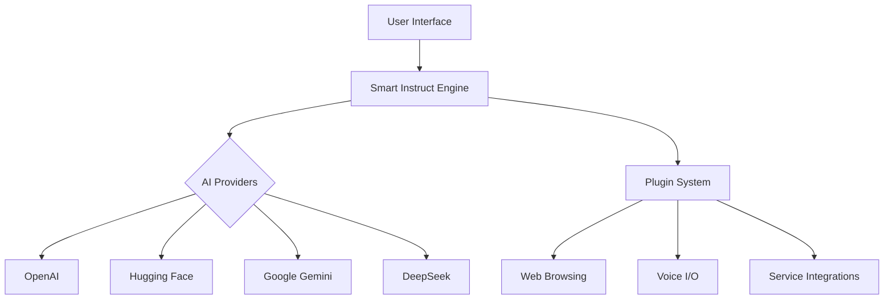

# Novix: Next-Gen AI Automation Platform

[](https://opensource.org/licenses/MIT)
[](https://python.org)
[](https://docker.com)
[](https://x.com/ainovix)

[](https://postimg.cc/SXsTGH04)

---

## 🚀 Introducing Novix

**Novix** revolutionizes AI task management and decision-making by unifying diverse AI providers into a single, adaptive platform. Designed for developers and enterprises, it combines:

- **Adaptive Memory**: Context-aware workflows with long/short-term memory optimization  
- **Multi-Provider Integration**: OpenAI, DeepSeek, Hugging Face, Google Gemini, and more  
- **Smart Interaction Tools**: Task automation, conversational continuity, and real-time execution  

🔮 **Vision**: Pave the way toward AGI with dynamic systems that learn, adapt, and evolve alongside users.

---

## ✨ Key Features

| **Category**              | **Capabilities**                                                                 |
|---------------------------|----------------------------------------------------------------------------------|
| **Core Intelligence**     | Smart Instruct, Chain Management, Context/Token Optimization                    |
| **Interaction**           | Smart Chat (web-aware), Voice I/O (ElevenLabs, Hugging Face), Custom Prompts     |
| **Execution**             | AI-Driven Task Agents, Web Browsing, Command Execution, RESTful API (FastAPI)   |
| **Infrastructure**        | Docker Deployment, Multi-OS Support, Extensible Plugin System                   |
| **Ecosystem**             | GitHub/Twitter/DALL-E Integrations, Code Evaluation, OAuth Authentication       |

---

## 🛠️ Installation

### Prerequisites
- **OS**: Windows/macOS/Linux  
- **Python 3.10+**  
- **Docker** (recommended)  
- **Git**

### Quick Start

```bash
# Clone repository
git clone https://github.com/AInovix/novix.git && cd novix

# Set up environment (Linux/Mac)
python3 -m venv .venv && source .venv/bin/activate

# Windows
python -m venv .venv && .\.venv\Scripts\activate

# Install dependencies
pip install -r requirements.txt

# Configure environment (edit .env)
cp .env.example .env  # Add your API keys (including DeepSeek)

# Launch with Docker (recommended)
docker-compose up --build

# Or run natively
python start.py
```
## Access Interfaces
* 🔗 [Web UI] (TBA)

* 📊 [Management Dashboard]

* 📚 [API Docs](https://github.com/AInovix/Novix)
## 🔒 Security
| Feature              | Implementation                                      |
|----------------------|----------------------------------------------------|
| API Key Management   | Env-based storage with encryption                  |
| Authentication       | OAuth (Google/GitHub/Microsoft)                    |
| Data Protection      | End-to-end encryption for I/O, minimal sensitive storage |

## 🌐 Architecture

## 🤝 Contribute
We welcome contributors! Follow these steps:

1. Fork the repository

2. Create a feature branch (git checkout -b feature/amazing-feature)

3. Commit changes (git commit -m 'Add amazing feature')

4. Push to branch (git push origin feature/amazing-feature)

5. Open a Pull Request

**Community Guidelines:**

* Report bugs via GitHub Issues

* Join our Discord Server

* Review CONTRIBUTING.md for coding standards

* Special focus welcome on DeepSeek integration improvements!

## 📜 License
MIT License - See LICENSE for details.

Novix is not affiliated with any third-party AI providers.
