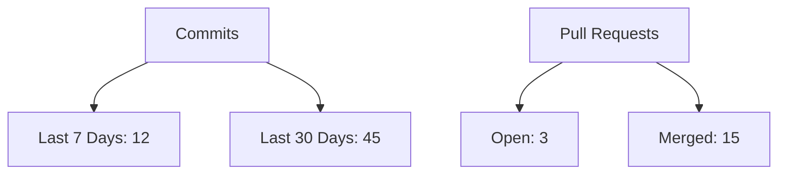

# 📊 Novix Project Dashboard

[](https://github.com/AInovix/novix)
[](https://github.com/AInovix/novix/commits/main)
[](https://github.com/AInovix/novix/issues)
[](https://github.com/AInovix/novix/pulls)

## 📈 Activity Metrics

## 🧑💻 Contributors
<!-- CONTRIBUTORS:START -->
Contributors

<!-- CONTRIBUTORS:END -->
## 📅 Recent Activity
<!-- ACTIVITY:START -->
* Latest Commit: [Add dashboard feature](https://github.com/AInovix/novix/commit) - 2 hours ago

* Recent PR: [Fix authentication bug](https://github.com/AInovix/novix/pull) - Merged

* New Issue: [Feature request: Voice integration](https://github.com/AInovix/novix/issues) - Open

<!-- ACTIVITY:END -->
## 📦 Deployment Status
| Environment | Status     | Version     | Last Deployed |
|-------------|------------|-------------|---------------|
| Production  | 🟢 Live    | v1.2.3      | 2023-12-15    |
| Staging     | 🟡 Testing | v1.2.4-rc1  | 2023-12-14    |
| Development | 🔄 Running | main        | Continuous    |

## 🛠️ System Health
```vegalite
{
  "$schema": "https://vega.github.io/schema/vega-lite/v5.json",
  "description": "Resource Usage",
  "data": {
    "values": [
      {"metric": "CPU", "usage": 65},
      {"metric": "Memory", "usage": 45},
      {"metric": "Storage", "usage": 82}
    ]
  },
  "mark": "bar",
  "encoding": {
    "x": {"field": "metric", "type": "nominal"},
    "y": {"field": "usage", "type": "quantitative"}
  }
}
```
Updated: <!-- TIMESTAMP:START -->2023-12-15 14:30 UTC<!-- TIMESTAMP:END -->
