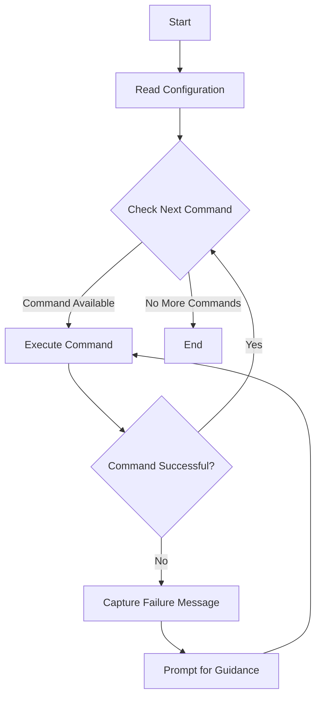

# Extension Commands

## Definition

Commands are predefined functions that can be executed by the agent. These commands are defined within the agent's configuration file under the `commands` section. The agent executes the commands in the sequence they are listed in the configuration file. It will wait for each command to complete before proceeding to the next. If a command fails, the agent captures the failure message and prompts for guidance on how to resolve the issue. The agent will then attempt to re-execute the command, iterating until the issue is resolved.

## Recommendations

### 1. Limit the Use of Commands

**Commands should be enabled only as needed.** Assigning excessive or unnecessary commands can lead to hallucinations—situations where the agent generates responses that are irrelevant to the task. When an agent has access to too much information, it may struggle to prioritize tasks effectively. This is analogous to a person being asked to juggle multiple tasks at once, leading to confusion and a failure to focus on completing any one task.

**Best Practice:** Assign only the commands necessary for the agent to complete its tasks efficiently. Avoid enabling a broad set of commands, as doing so can negatively impact the agent's performance and result in poor outcomes.

### 2. Caution Regarding Full Access

**Enabling all available commands for an agent can severely degrade its performance and may produce undesirable results.** Specifically, giving an agent unrestricted access to your system could result in dangerous commands being executed—such as formatting critical files or modifying system settings. Always ensure that the permissions granted to agents are tightly controlled and limited to only what is necessary.

**Recommendation:** Run agents within isolated environments like Docker or Virtual Machines to mitigate the risks associated with broader system access. This containment ensures that the agent can operate safely without compromising system integrity.

### 3. Creating Custom Commands

You don't need to be a developer to create custom commands for your agent. Simply provide the agent with the "Create a new command" functionality. By specifying the desired command, the agent will automatically generate a new command file, which will be available for enabling within the Agent Settings. This provides flexibility and allows for the extension of the agent's capabilities without requiring programming knowledge.

## Sample Commands

Below is a non-exhaustive list of some common extension commands. You can find a complete list of commands within the repository. Each extension file can define as many commands as needed.

- Ask AI Agent [AGENT_NAME]
- Instruct AI Agent [AGENT_NAME]
- Create a New Command
- Scrape Text with Playwright
- Scrape Links with Playwright
- Generate Image
- Searx Search
- Read Audio from File
- Read Audio
- Speak with TTS (Text-to-Speech)
- Google Search
- Evaluate Code
- Analyze Pull Request
- Perform Automated Testing
- Run CI/CD Pipeline
- Improve Code
- Write Tests
- Clone GitHub Repository
- Create GitHub Repository
- Execute Python File
- Execute Shell Command
- Get Datetime
- Browse Website
- Is Valid URL
- Sanitize URL
- Check Local File Access
- Get Response
- Send Email with SendGrid
- Send Tweet
- Check Duplicate Operation
- Read File
- Ingest File
- Write to File
- Append to File
- Delete File
- Search Files

## Diagram of Command Execution Flow

