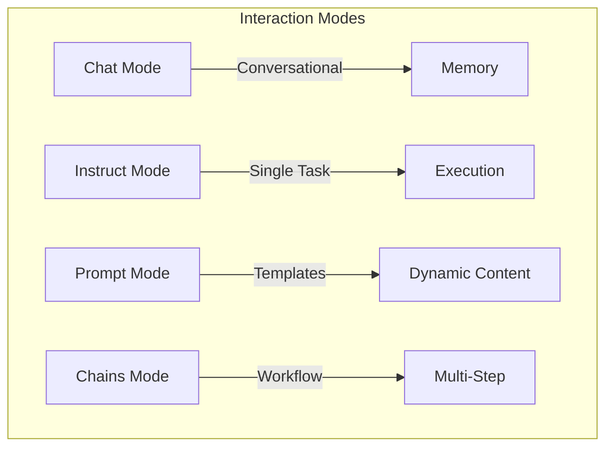
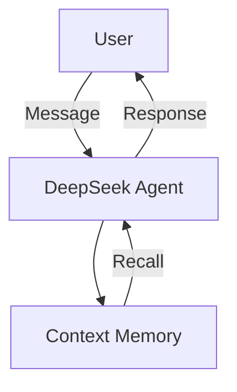
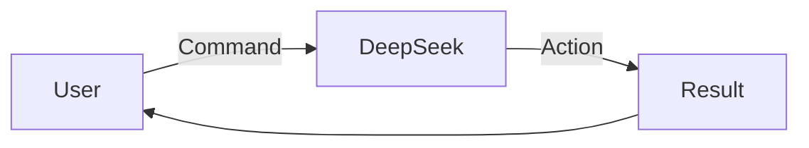
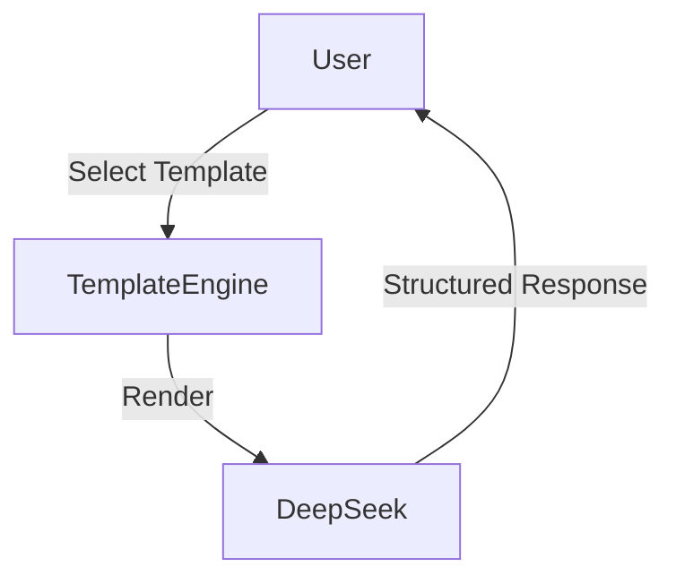
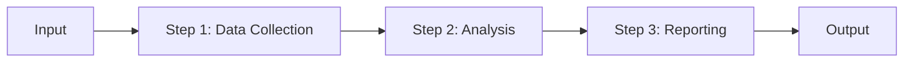
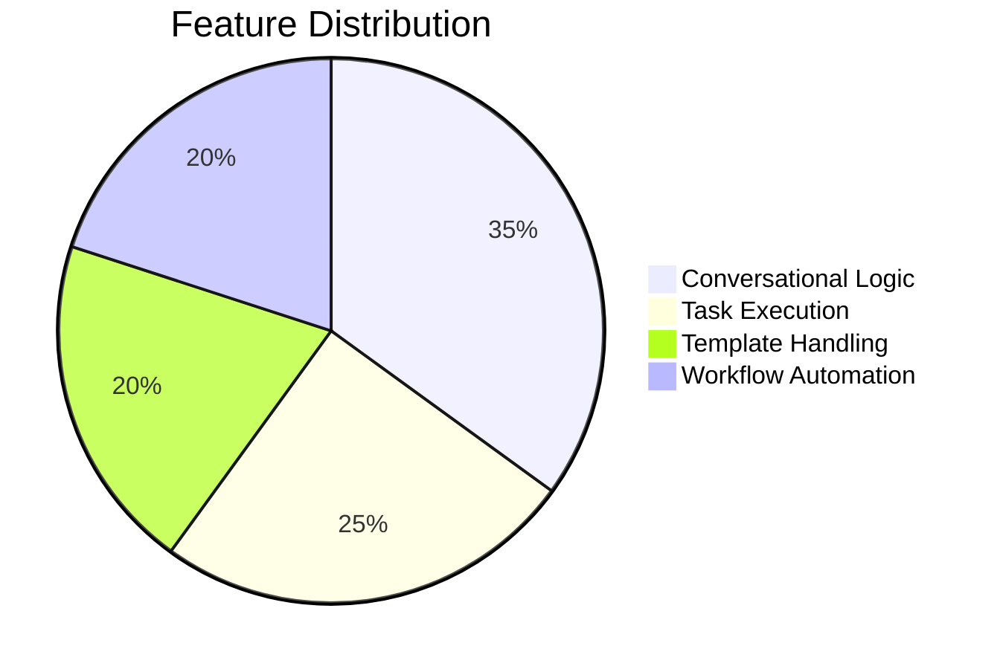

# Agent Interactions

The Agent Interactions page in Novix provides four distinct modes for engaging with your agents. Below is an enhanced documentation with visual workflows and DeepSeek integration.


## 1. Chat Mode
Dynamic conversation mode with contextual awareness.


**Key Features:**

* Conversational Memory: Uses external data (files, websites) when available

* Default Knowledge: Leverages DeepSeek's base training when no custom data exists

**Example:**
```python
# Initiate conversation with DeepSeek
response = Novix.chat(
    agent_name="deepseek",
    user_message="Explain Novix architecture"
)
print(response)
```
## 2. Instruct Mode
Direct command execution for immediate task completion.

**Key Features:**

* Single-step task execution

* Direct command mapping

**Example:**
# Execute translation command
```python
Novix.instruct(
    agent_name="deepseek",
    command="Translate this technical document to Japanese"
)
```
## 3. Prompt Mode
Template-driven interactions with dynamic variables.

**Key Features:**

* Predefined template library

* Dynamic variable injection ({user_input}, {timestamp})

**Example:**
```python
# Generate report using template
response = Novix.prompt(
    agent_name="deepseek",
    prompt_template="technical_writer",
    variables={"topic": "neural networks"}
)
```
## 4. Chains Mode
Automated workflows with multi-step execution.

**Key Features:**

* Multi-agent orchestration

* Dynamic input piping

* Conditional workflows

**Example:**
```python
chain = Novix.create_chain(
    agent_name="deepseek",
    steps=[
        "Collect user preferences",
        "Generate recommendations",
        "Format output"
    ]
)
result = Novix.run_chain(
    chain_name="rec_system",
    input_data="user_123"
)
```
# Advanced Configuration
## Core Interaction Settings
| Parameter           | Description                              | Default |
|---------------------|------------------------------------------|---------|
| Context Window      | Previous exchanges to consider           | 5       |
| Memory Injection    | External memory collections to use       | 0       |
| Web Search Depth    | Link recursion depth for research        | 2       |
| Response Samples    | Number of response variants to generate  | 1       |

## Chain Control Options
| Feature            | Description                     | Use Case              |
|--------------------|---------------------------------|----------------------|
| Step Isolation     | Execute individual chain components | Debugging            |
| Partial Execution  | Start chain from specific node  | Resume workflows     |
| Full Trace         | Display all intermediate results| Audit trails         |

# DeepSeek Integration Matrix

