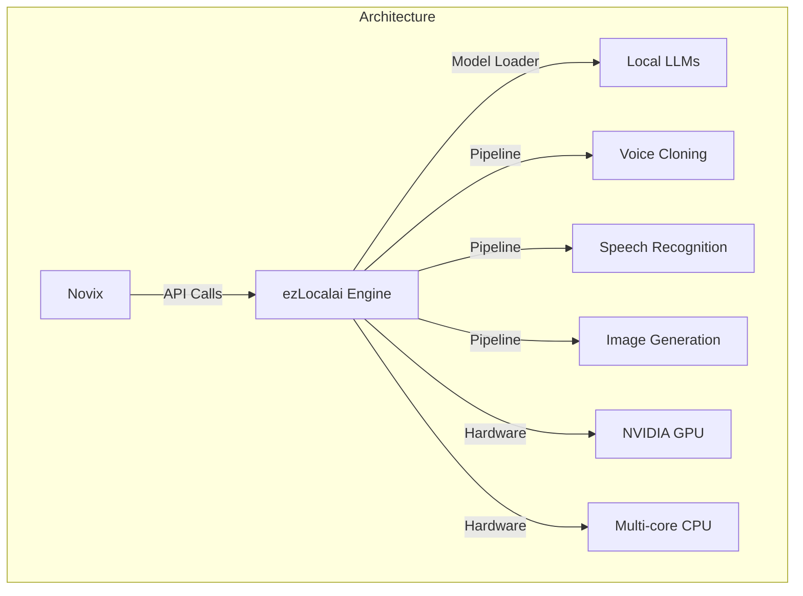
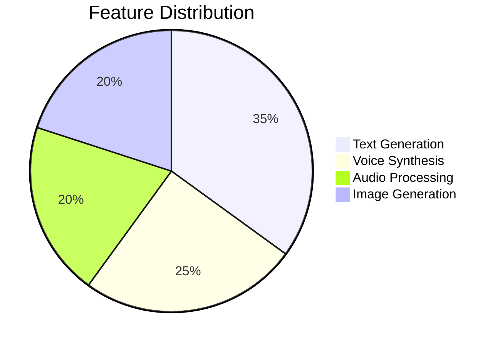
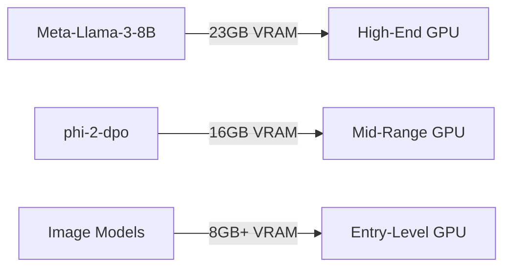
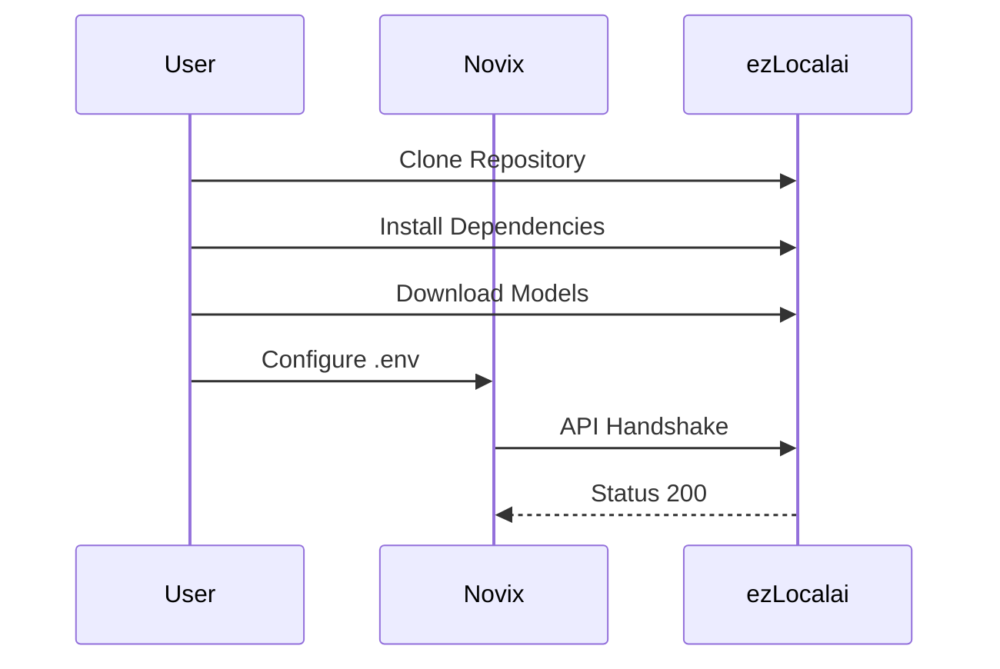
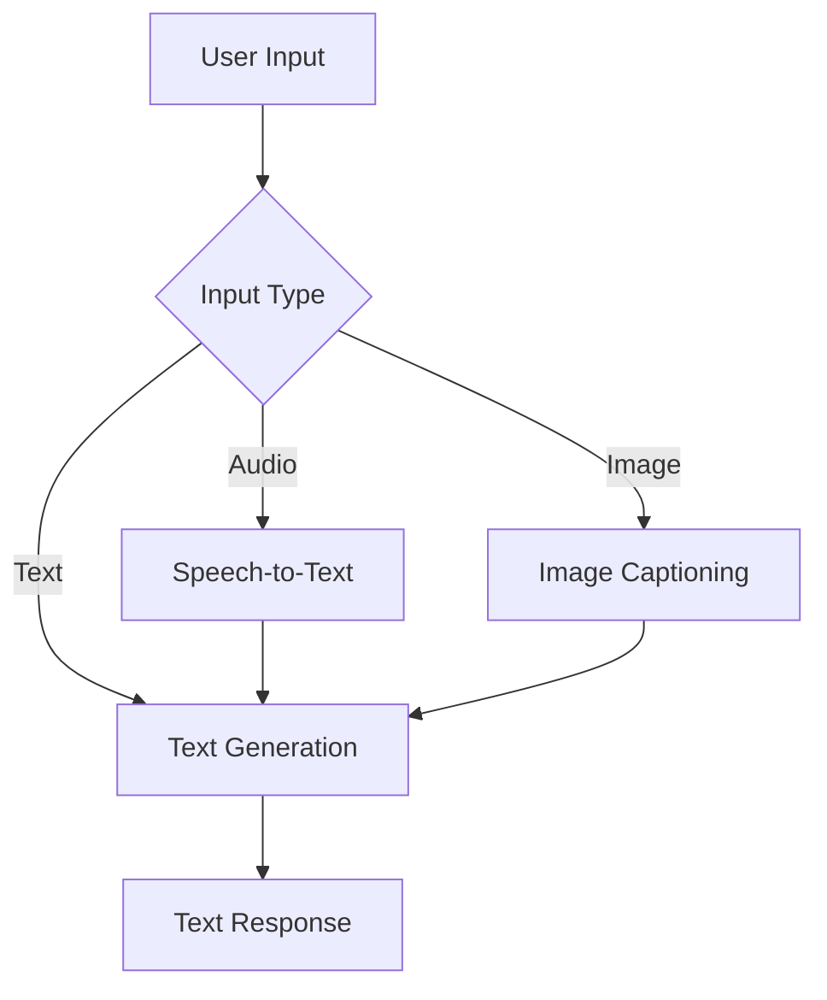
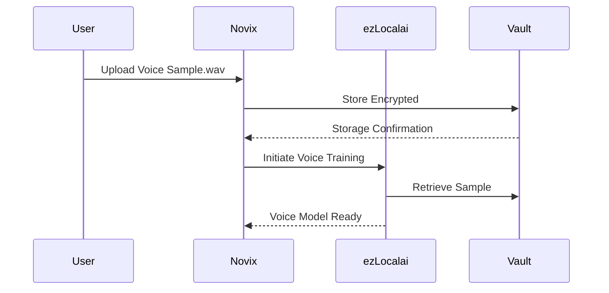
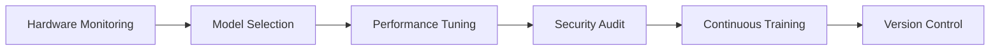
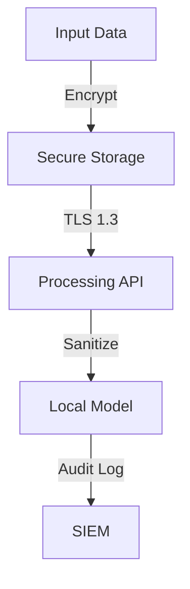
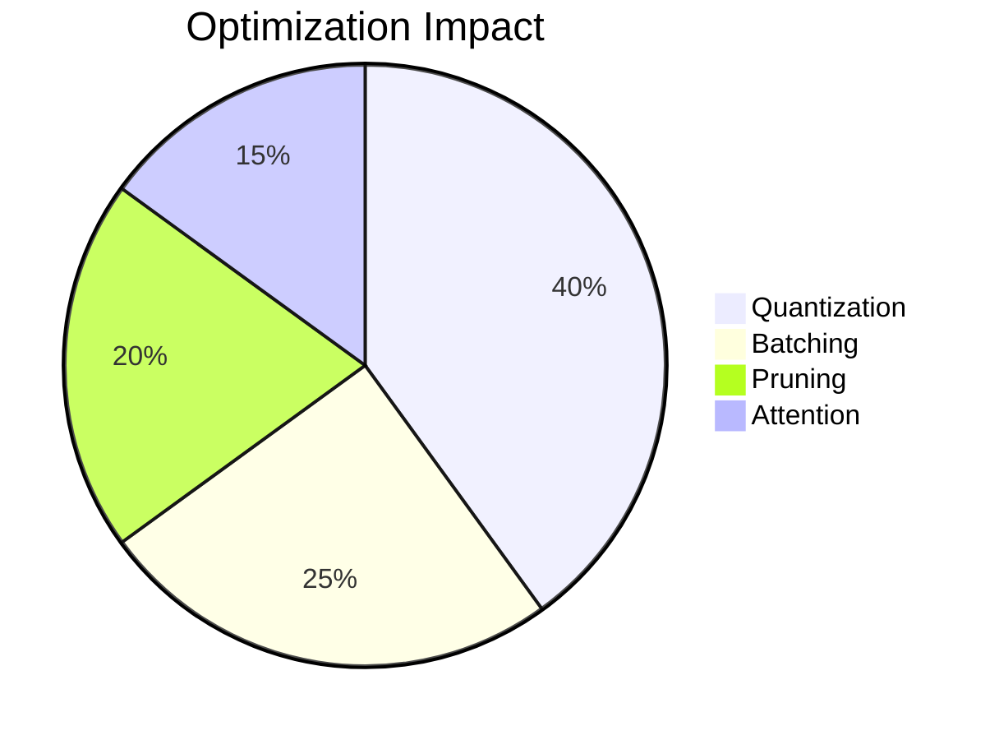

# ezLocalAI Provider: Enterprise-Grade Local AI Orchestration


## Core Capabilities Matrix

## Hardware Requirements

| Model                | Context Size | VRAM Required | Minimum GPU   |
|----------------------|--------------|---------------|---------------|
| Meta-Llama-3-8B      | 32k          | 23GB          | NVIDIA A100   |
| phi-2-dpo            | 16k          | 16GB          | RTX 4090      |
| Stable Diffusion XL  | N/A          | 8GB           | RTX 3080      |
| Whisper-large-v3     | 30s audio    | 4GB           | RTX 3060      |

## Installation & Configuration Workflow

## Optimized Environment Configuration
```bash
# Core Settings
AI_PROVIDER=ezlocalai
EZLOCALAI_API_URL=http://127.0.0.1:8091
EZLOCALAI_API_KEY=sec_$TOKEN

# Model Configuration
EZLOCALAI_MODEL=Meta-Llama-3-8B-Instruct
EZLOCALAI_MAX_TOKENS=32768
EZLOCALAI_GPU_LAYERS=42

# Performance Tuning
EZLOCALAI_TEMPERATURE=1.33
EZLOCALAI_TOP_P=0.95
EZLOCALAI_BATCH_SIZE=512
```
## Advanced Operations
**Multi-Modal Processing Pipeline**

## VRAM Optimization Strategy
```python
def optimize_vram(model_config):
    """
    Dynamically adjusts model parameters based on available resources
    
    Args:
        model_config (dict): Current model configuration
        
    Returns:
        dict: Optimized configuration
    """
    vram = get_available_vram()
    
    if vram < 16:
        model_config['max_tokens'] = 4096
        model_config['gpu_layers'] = 24
    elif vram < 24:
        model_config['max_tokens'] = 16384
        model_config['gpu_layers'] = 32
    else:
        model_config['max_tokens'] = 32768
        model_config['gpu_layers'] = 42
        
    return model_config
```
## Enterprise Integration Patterns
**Secure Voice Cloning Workflow**

## High-Performance Inference API
```python
class LocalAIProvider:
    
    @retry(stop=stop_after_attempt(3), wait=wait_fixed(1))
    async def generate_text(self, prompt: str, **kwargs) -> str:
        """
        Executes local model inference with fallback strategies
        
        Args:
            prompt: Input text for generation
            kwargs: Generation parameters
            
        Returns:
            Generated text response
        """
        try:
            response = await self._execute_inference(
                engine=kwargs.get('model', self.default_model),
                prompt=prompt,
                temperature=kwargs.get('temperature', 1.33),
                max_tokens=kwargs.get('max_tokens', 2048)
            )
            return response.text
        except ResourceWarning:
            self.logger.warning("Optimizing VRAM allocation...")
            self.optimize_vram()
            raise
```
## Operational Best Practices

**1. Resource Management**
```python
# Context-aware VRAM allocation
def dynamic_batching(inputs):
    batch_size = calculate_optimal_batch_size(
        model_size=MODEL_CONFIG['size'],
        available_vram=get_available_vram()
    )
    return process_in_batches(inputs, batch_size)
```
**2. Voice Cloning Standards**
```
- Minimum 44.1kHz WAV format
- 10-15 second clean audio sample
- RMS level between -20dB and -12dB
- Noise floor below -60dB
```
**3. Security Protocols**

## Performance Optimization Table
| Technique           | VRAM Reduction | Speed Improvement | Quality Impact |
|---------------------|----------------|-------------------|----------------|
| 4-bit Quantization  | 40%            | 25%               | <2%            |
| Layer Offloading    | 35%            | -15%              | None           |
| Dynamic Batching    | 10%            | 40%               | None           |
| Flash Attention     | 5%             | 30%               | None           |
| Pruning             | 50%            | 20%               | 5-10%          |



