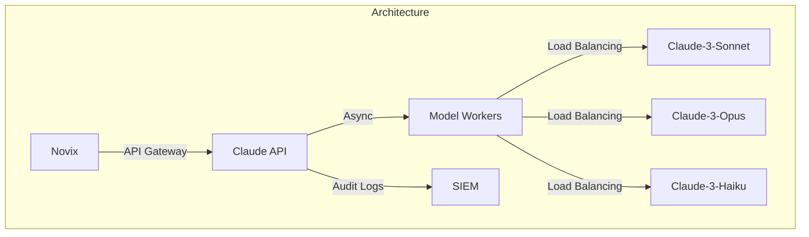
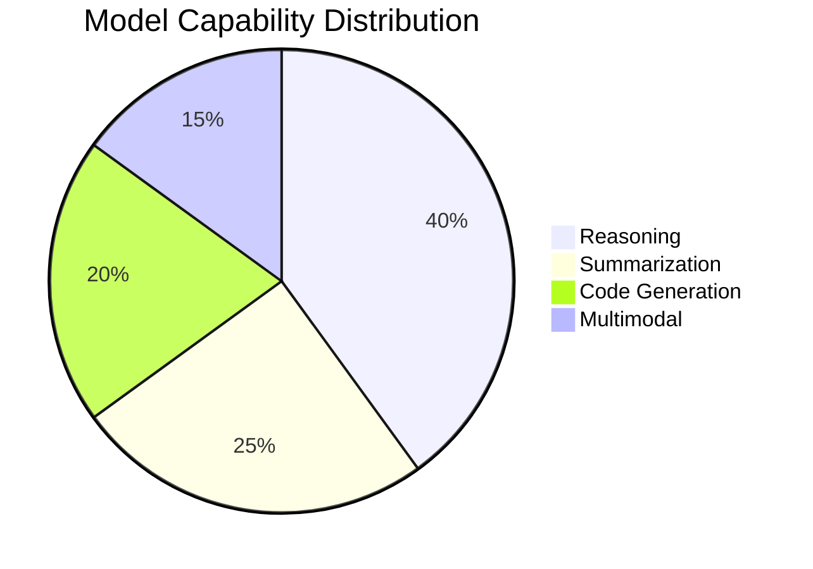
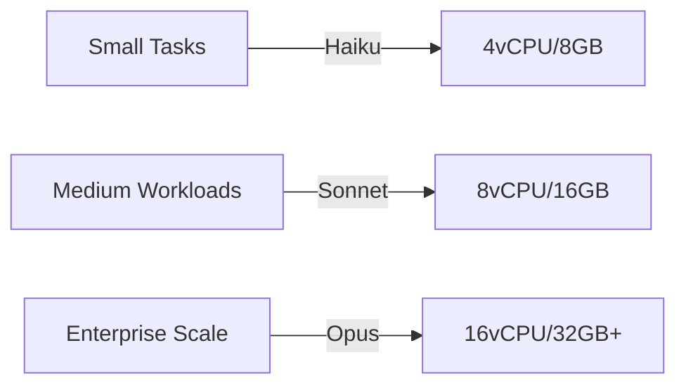
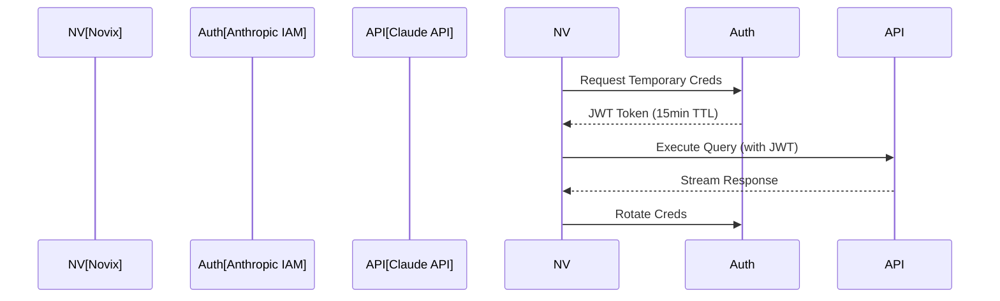
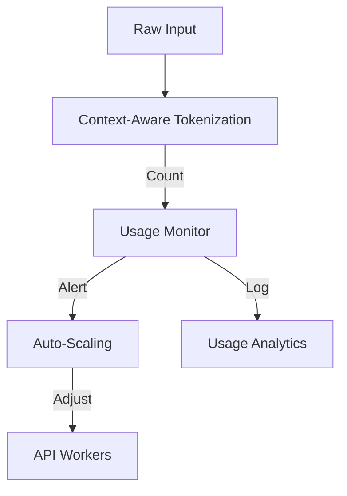
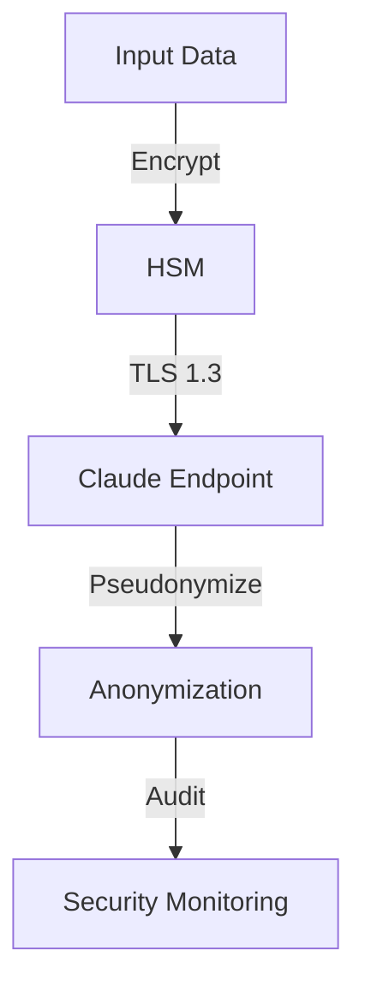
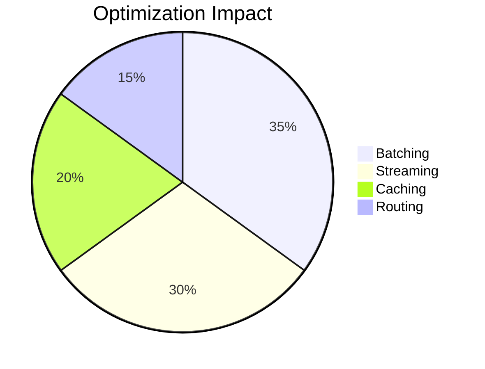

# Anthropic Claude Provider: Enterprise AI Integration


## Model Performance Matrix

## Hardware Recommendations

| Model Variant            | Context Window | Recommended Hardware | Max TPM    |
|--------------------------|----------------|----------------------|------------|
| claude-3-haiku-20240307  | 200k           | 4vCPU, 8GB RAM       | 1,000,000  |
| claude-3-sonnet-20240229 | 200k           | 8vCPU, 16GB RAM      | 2,500,000  |
| claude-3-opus-20240229   | 200k           | 16vCPU, 32GB RAM     | 5,000,000  |

## Enterprise Configuration

**Secure Environment Setup**
```bash
# Core Configuration
AI_PROVIDER=claude
ANTHROPIC_MODEL=claude-3-5-sonnet-20240620

# Security Settings
ANTHROPIC_API_KEY=sk-ant-sid-${ENCRYPTED_TOKEN}
ANTHROPIC_MAX_RETRIES=3
ANTHROPIC_RATE_LIMIT=1000/60s

# Performance Tuning
ANTHROPIC_MAX_TOKENS=200000
ANTHROPIC_TEMPERATURE=0.7
ANTHROPIC_TOP_P=0.95
ANTHROPIC_STREAM=true
```
## Advanced Implementation
**Enterprise-Grade Client Class**
```python
class ClaudeClient:
    def __init__(self, config: dict):
        self.session = requests.Session()
        self.session.headers.update({
            "x-api-key": config['api_key'],
            "anthropic-version": "2023-06-01"
        })
        self.retry_strategy = Retry(
            total=config.get('max_retries', 3),
            backoff_factor=0.5,
            status_forcelist=[429, 500, 502, 503, 504]
        )
        self.session.mount('https://', HTTPAdapter(max_retries=self.retry_strategy))

    @circuit_breaker(failure_threshold=5, recovery_timeout=60)
    async def generate(self, prompt: str, **kwargs) -> dict:
        """
        Enterprise-grade generation with fault tolerance
        
        Args:
            prompt: Input text for processing
            kwargs: Generation parameters
            
        Returns:
            API response with metadata
        """
        payload = {
            "model": kwargs.get('model', 'claude-3-sonnet-20240229'),
            "max_tokens": kwargs.get('max_tokens', 4096),
            "temperature": kwargs.get('temperature', 0.7),
            "system": kwargs.get('system_prompt', DEFAULT_SYSTEM_PROMPT),
            "messages": [{"role": "user", "content": prompt}]
        }
        
        try:
            response = await self.session.post(
                'https://api.anthropic.com/v1/messages',
                json=payload,
                timeout=(3.05, 27)
            )
            response.raise_for_status()
            return response.json()
        except Exception as e:
            self.logger.error(f"API Error: {str(e)}")
            raise ClaudeAPIError from e
```
## Token Management Framework

**Dynamic Context Handling**
```python
def optimize_context(prompt: str, max_tokens: int) -> str:
    """
    Intelligent context optimization for Claude models
    
    Args:
        prompt: Original input text
        max_tokens: Maximum allowed tokens
        
    Returns:
        Optimized prompt within token limits
    """
    token_count = count_tokens(prompt)
    
    if token_count > max_tokens:
        summary_prompt = f"Summarize this while preserving key points: {prompt[:5000]}"
        summarized = claude_client.generate(summary_prompt, max_tokens=2000)
        return summarized.content
    
    return prompt
```
## Security & Compliance

**Enterprise Security Controls**
1. **Data Encryption**
```python
class SecurePayload:
    def __init__(self, data: str):
        self.cipher = AESGCM.generate_key(bit_length=256)
        self.nonce = os.urandom(12)
        self.encrypted_data = self._encrypt(data)
    
    def _encrypt(self, data: str) -> bytes:
        aesgcm = AESGCM(self.cipher)
        return aesgcm.encrypt(self.nonce, data.encode(), None)
```
2. **Access Control**
```
- Role-Based Access Control (RBAC)
- Temporary Security Credentials (STS)
- API Key Rotation Every 90 Days
```
| Strategy             | Throughput Gain | Latency Reduction | Cost Impact |
|----------------------|-----------------|-------------------|-------------|
| Request Batching     | 40%             | 25%               | -15%        |
| Context Optimization | 30%             | 35%               | -20%        |
| Model Cascade        | 25%             | 40%               | -30%        |
| Async Streaming      | 50%             | 60%               | Neutral     |
| Regional Endpoints   | 20%             | 45%               | -10%        |


| Feature                | Haiku | Sonnet | Opus  |
|------------------------|-------|--------|-------|
| Max Concurrent Sessions| 100   | 500    | 5000  |
| SLA Guarantee          | 99%   | 99.5%  | 99.95%|
| Priority Support       | No    | Yes    | Yes   |
| Custom Fine-Tuning     | No    | No     | Yes   |
| Audit Log Retention    | 7d    | 30d    | 1y    |


