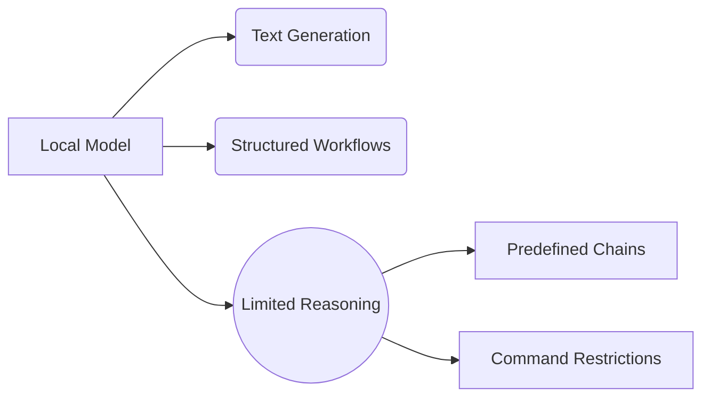
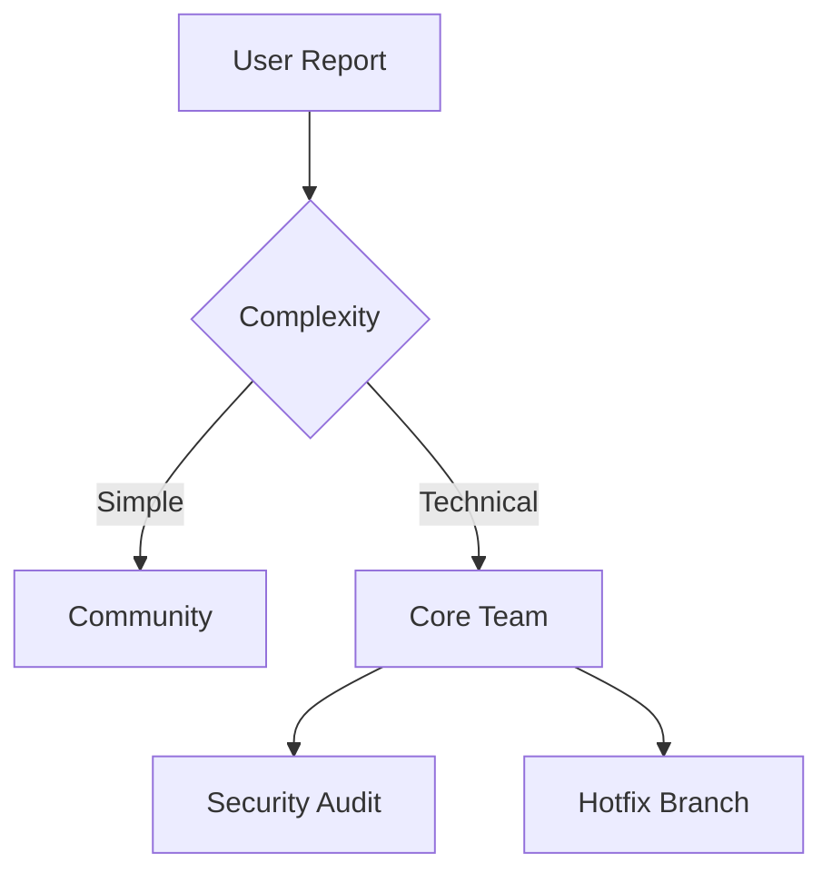

# Novix Deployment Considerations & Distribution Guide

## 🧠 LLM Operational Considerations

### Context Window Management


```python
# Example of text chunking for large documents
from novix.tokenizer import adaptive_chunker

document = load_large_file("novel.pdf")
chunks = adaptive_chunker(document, model="gpt-4")
for chunk in chunks:
    response = process_chunk(chunk)
```
Token Limit Strategies  
--------------------------------------------------------------------------  
| Scenario           | Challenge                   | Solution                        |
|--------------------|-----------------------------|---------------------------------|
| Full Book Analysis | Exceeds context window      | Implement RAG architecture      |
| Specific Queries   | Requires precision          | Metadata tagging system         |
| Real-time Processing | Latency issues           | Streaming token handling        |
--------------------------------------------------------------------------  

Local Model Constraints

Capability Matrix  
------------------------------------------------  
| Feature            | Local Model | Cloud Model |
|--------------------|-------------|-------------|
| Text Generation    | ✅ Excellent | ✅ Excellent |
| Complex Reasoning  | ⚠️ Limited   | ✅ Strong    |
| Command Execution  | ❌ Restricted| ✅ Allowed   |
| Offline Operation  | ✅ Supported | ❌ Requires API |
------------------------------------------------
## 📦 ISO Distribution Pipeline
Automated Build System
```bash
# Build ISO with Packer
packer build -var 'iso_checksum=sha256:...' novix-agent.json

# Generate checksum
sha256sum output/novix-agent.iso > sha256sums.txt
```
Packer Template (novix-agent.json)
```json
{
  "builders": [{
    "type": "qemu",
    "iso_url": "https://releases.ubuntu.com/22.04.3/ubuntu-22.04.3-live-server-amd64.iso",
    "ssh_username": "novix-user",
    "ssh_password": "{{env `NOVIX_PASSWORD`}}",
    "output_directory": "build-output"
  }],
  "provisioners": [{
    "type": "ansible",
    "playbook_file": "provision-agent.yml"
  }]
}
```
Playbook.com Deployment Checklist:
1. ISO Variants

* Novix-Base.iso (Minimal Agent)

* Novix-Docker.iso (Container Runtime)

* Novix-GPU.iso (CUDA Enabled)

2. Security Measures

* Signed GPG manifests

* Air-gapped build process

* Ephemeral build environments

3. User Verification Flow

```bash
# Verify ISO integrity
gpg --verify novix-agent.iso.sig
sha256sum -c sha256sums.txt
```
## 🛠️ Support Framework  
**Multi-Tier Support Channels**  
| Level | Channel           | Response Time | Scope             |
|-------|-------------------|---------------|-------------------|
| 1️⃣    | Community Forum   | 24-48h        | General Q&A       |
| 2️⃣    | Discord Support   | <12h          | Technical Issues  |
| 3️⃣    | Enterprise SLA    | <1h           | Critical Systems  |

Issue Reporting Protocol
* Reproduction Template
```bash
  **Environment**:
- Novix Version: [0.4.2]
- Hardware: [CPU/GPU]
- Deployment: [ISO/Docker]

**Steps to Reproduce**:
1. 
2. 
3. 

**Expected Behavior**:

**Actual Behavior**:

**Logs**:
```
novix-agent --debug 2>&1 | tee debug.log

2. Escalation Path


## 🔄 Update Management
```bash
# Secure update process
novix-cli update --channel stable \
    --verify-signature \
    --rollback-on-error
```
Update Architecture
Update Flow
