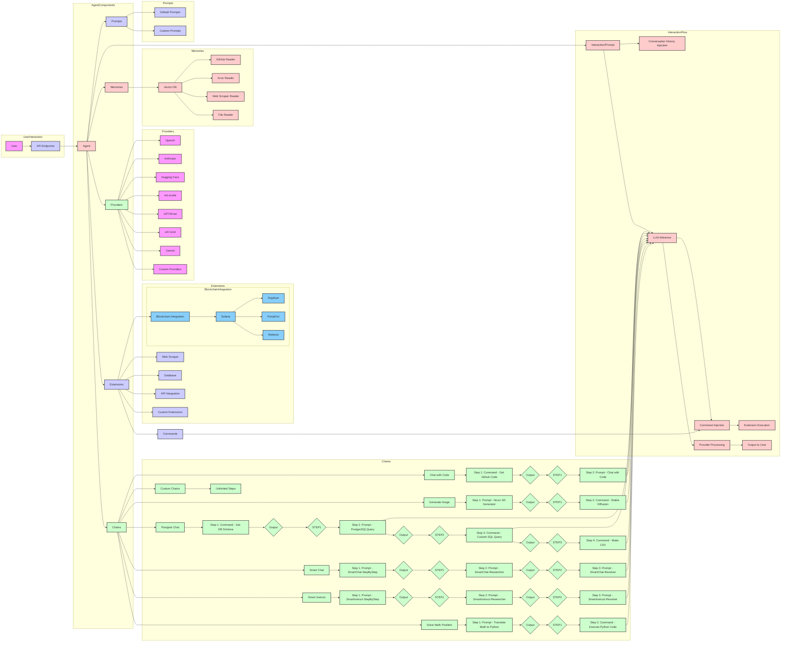

# Platform Architecture

```mermaid
graph LR
    subgraph UserInteraction
        A[User] --> B[API Endpoints]
        style A fill:#f9f,stroke:#333,stroke-width:2px
        style B fill:#ccf,stroke:#333,stroke-width:2px
    end
    B --> C[Agent]
    subgraph AgentComponents
        C --> D[Providers]
        C --> E[Extensions]
        C --> F[Memories]
        C --> G[Chains]
        C --> H[Prompts]
        style C fill:#fcc,stroke:#333,stroke-width:2px
        style D fill:#cfc,stroke:#333,stroke-width:2px
        style E fill:#ccf,stroke:#333,stroke-width:2px
        style F fill:#fcc,stroke:#333,stroke-width:2px
        style G fill:#cfc,stroke:#333,stroke-width:2px
        style H fill:#ccf,stroke:#333,stroke-width:2px
    end
    subgraph Providers
        D --> I[OpenAI]
        D --> J[Anthropic]
        D --> K[Hugging Face]
        D --> L[ezLocalai]
        D --> M[GPT4Free]
        D --> N[xAI Grok]
        D --> P[Gemini]
        D --> O[Custom Providers]
        style I fill:#f9f,stroke:#333,stroke-width:2px
        style J fill:#f9f,stroke:#333,stroke-width:2px
        style K fill:#f9f,stroke:#333,stroke-width:2px
        style L fill:#f9f,stroke:#333,stroke-width:2px
        style M fill:#f9f,stroke:#333,stroke-width:2px
        style N fill:#f9f,stroke:#333,stroke-width:2px
        style P fill:#f9f,stroke:#333,stroke-width:2px
        style O fill:#f9f,stroke:#333,stroke-width:2px
    end
    subgraph Extensions
        E --> Q[Web Scraper]
        E --> R[Database]
        E --> S[API Integration]
        E --> T[Custom Extensions]
        E --> U[Blockchain Integration]
        subgraph BlockchainIntegration
            U --> V[Solana]
            V --> W[Raydium]
            V --> X[PumpFun]
            V --> Y[Meteora]
            style V fill:#87cefa,stroke:#333,stroke-width:2px
            style W fill:#87cefa,stroke:#333,stroke-width:2px
            style X fill:#87cefa,stroke:#333,stroke-width:2px
            style Y fill:#87cefa,stroke:#333,stroke-width:2px
        end
        style Q fill:#ccf,stroke:#333,stroke-width:2px
        style R fill:#ccf,stroke:#333,stroke-width:2px
        style S fill:#ccf,stroke:#333,stroke-width:2px
        style T fill:#ccf,stroke:#333,stroke-width:2px
        style U fill:#87cefa,stroke:#333,stroke-width:2px
    end
    subgraph Memories
        F --> Z[Vector DB]
        Z --> AA[GitHub Reader]
        Z --> AB[Arxiv Reader]
        Z --> AC[Web Scraper Reader]
        Z --> AD[File Reader]
        style Z fill:#fcc,stroke:#333,stroke-width:2px
        style AA fill:#fcc,stroke:#333,stroke-width:2px
        style AB fill:#fcc,stroke:#333,stroke-width:2px
        style AC fill:#fcc,stroke:#333,stroke-width:2px
        style AD fill:#fcc,stroke:#333,stroke-width:2px
    end
    subgraph Chains
        G --> AE[Chat with Code]
        AE --> AF[Step 1: Command - Get Github Code]
        AF --> AG{Output}
        AG --> AH{STEP1}
        AH --> AI[Step 2: Prompt - Chat with Code]
        G --> AJ[Generate Image]
        AJ --> AK[Step 1: Prompt - Novix SD Generator]
        AK --> AL{Output}
        AL --> AM{STEP1}
        AM --> AN[Step 2: Command - Stable Diffusion]
        G --> AO[Postgres Chat]
        AO --> AP[Step 1: Command - Get DB Schema]
        AP --> AQ{Output}
        AQ --> AR{STEP1}
        AR --> AS[Step 2: Prompt - PostgreSQLQuery]
        AS --> AT{Output}
        AT --> AU{STEP2}
        AU --> AV[Step 3: Command - Custom SQL Query]
        AV --> AW{Output}
        AW --> AX{STEP3}
        AX --> AY[Step 4: Command - Make CSV]
        G --> AZ[Smart Chat]
        AZ --> BA[Step 1: Prompt - SmartChat-StepByStep]
        BA --> BB{Output}
        BB --> BC{STEP1}
        BC --> BD[Step 2: Prompt - SmartChat-Researcher]
        BD --> BE{Output}
        BE --> BF{STEP2}
        BF --> BG[Step 3: Prompt - SmartChat-Resolver]
        G --> BH[Smart Instruct]
        BH --> BI[Step 1: Prompt - SmartInstruct-StepByStep]
        BI --> BJ{Output}
        BJ --> BK{STEP1}
        BK --> BL[Step 2: Prompt - SmartInstruct-Researcher]
        BL --> BM{Output}
        BM --> BN{STEP2}
        BN --> BO[Step 3: Prompt - SmartInstruct-Resolver]
        G --> BP[Solve Math Problem]
        BP --> BQ[Step 1: Prompt - Translate Math to Python]
        BQ --> BR{Output}
        BR --> BS{STEP1}
        BS --> BT[Step 2: Command - Execute Python Code]
        G --> BU[Custom Chains]
        BU --> BV[Unlimited Steps]
        style AE fill:#cfc,stroke:#333,stroke-width:2px
        style AF fill:#cfc,stroke:#333,stroke-width:2px
        style AG fill:#cfc,stroke:#333,stroke-width:2px
        style AH fill:#cfc,stroke:#333,stroke-width:2px
        style AI fill:#cfc,stroke:#333,stroke-width:2px
        style AJ fill:#cfc,stroke:#333,stroke-width:2px
        style AK fill:#cfc,stroke:#333,stroke-width:2px
        style AL fill:#cfc,stroke:#333,stroke-width:2px
        style AM fill:#cfc,stroke:#333,stroke-width:2px
        style AN fill:#cfc,stroke:#333,stroke-width:2px
        style AO fill:#cfc,stroke:#333,stroke-width:2px
        style AP fill:#cfc,stroke:#333,stroke-width:2px
        style AQ fill:#cfc,stroke:#333,stroke-width:2px
        style AR fill:#cfc,stroke:#333,stroke-width:2px
        style AS fill:#cfc,stroke:#333,stroke-width:2px
        style AT fill:#cfc,stroke:#333,stroke-width:2px
        style AU fill:#cfc,stroke:#333,stroke-width:2px
        style AV fill:#cfc,stroke:#333,stroke-width:2px
        style AW fill:#cfc,stroke:#333,stroke-width:2px
        style AX fill:#cfc,stroke:#333,stroke-width:2px
        style AY fill:#cfc,stroke:#333,stroke-width:2px
        style AZ fill:#cfc,stroke:#333,stroke-width:2px
        style BA fill:#cfc,stroke:#333,stroke-width:2px
        style BB fill:#cfc,stroke:#333,stroke-width:2px
        style BC fill:#cfc,stroke:#333,stroke-width:2px
        style BD fill:#cfc,stroke:#333,stroke-width:2px
        style BE fill:#cfc,stroke:#333,stroke-width:2px
        style BF fill:#cfc,stroke:#333,stroke-width:2px
        style BG fill:#cfc,stroke:#333,stroke-width:2px
        style BH fill:#cfc,stroke:#333,stroke-width:2px
        style BI fill:#cfc,stroke:#333,stroke-width:2px
        style BJ fill:#cfc,stroke:#333,stroke-width:2px
        style BK fill:#cfc,stroke:#333,stroke-width:2px
        style BL fill:#cfc,stroke:#333,stroke-width:2px
        style BM fill:#cfc,stroke:#333,stroke-width:2px
        style BN fill:#cfc,stroke:#333,stroke-width:2px
        style BO fill:#cfc,stroke:#333,stroke-width:2px
        style BP fill:#cfc,stroke:#333,stroke-width:2px
        style BQ fill:#cfc,stroke:#333,stroke-width:2px
        style BR fill:#cfc,stroke:#333,stroke-width:2px
        style BS fill:#cfc,stroke:#333,stroke-width:2px
        style BT fill:#cfc,stroke:#333,stroke-width:2px
        style BU fill:#cfc,stroke:#333,stroke-width:2px
        style BV fill:#cfc,stroke:#333,stroke-width:2px
    end
    subgraph Prompts
        H --> BW[Default Prompts]
        H --> BX[Custom Prompts]
        style BW fill:#ccf,stroke:#333,stroke-width:2px
        style BX fill:#ccf,stroke:#333,stroke-width:2px
    end
    subgraph InteractionFlow
        C --> BY[Interaction/Prompt]
        BY --> BZ[Conversation History Injection]
        BY --> CA[LLM Inference]
        CA --> CB[Command Injection]
        CA --> CC[Provider Processing]
        CB --> CD[Extension Execution]
        CC --> CE[Output to User]
        style BY fill:#fcc,stroke:#333,stroke-width:2px
        style BZ fill:#fcc,stroke:#333,stroke-width:2px
        style CA fill:#fcc,stroke:#333,stroke-width:2px
        style CB fill:#fcc,stroke:#333,stroke-width:2px
        style CC fill:#fcc,stroke:#333,stroke-width:2px
        style CD fill:#fcc,stroke:#333,stroke-width:2px
        style CE fill:#fcc,stroke:#333,stroke-width:2px
    end
    AI --> CA
    AN --> CA
    AS --> CA
    AV --> CA
    AY --> CA
    BG --> CA
    BO --> CA
    BT --> CA
    E --> CF[Commands]
    CF --> CB
    style CF fill:#ccf,stroke:#333,stroke-width:2px
```
