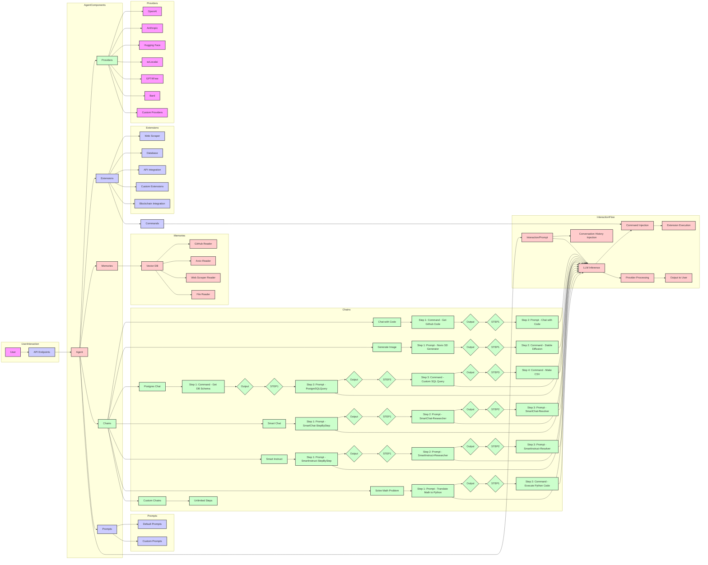

# Platform Architecture

```mermaid
graph LR
    subgraph UserInteraction
        A[User] --> B[API Endpoints]
        style A fill:#f9f,stroke:#333,stroke-width:2px
        style B fill:#ccf,stroke:#333,stroke-width:2px
    end
    B --> C[Agent]
    subgraph AgentComponents
        C --> D[Providers]
        C --> E[Extensions]
        C --> F[Memories]
        C --> G[Chains]
        C --> H[Prompts]
        style C fill:#fcc,stroke:#333,stroke-width:2px
        style D fill:#cfc,stroke:#333,stroke-width:2px
        style E fill:#ccf,stroke:#333,stroke-width:2px
        style F fill:#fcc,stroke:#333,stroke-width:2px
        style G fill:#cfc,stroke:#333,stroke-width:2px
        style H fill:#ccf,stroke:#333,stroke-width:2px
    end
    subgraph Providers
        D --> I[OpenAI]
        D --> J[Anthropic]
        D --> K[Hugging Face]
        D --> L[ezLocalai]
        D --> M[GPT4Free]
        D --> N[Bard]
        D --> O[Custom Providers]
        style I fill:#f9f,stroke:#333,stroke-width:2px
        style J fill:#f9f,stroke:#333,stroke-width:2px
        style K fill:#f9f,stroke:#333,stroke-width:2px
        style L fill:#f9f,stroke:#333,stroke-width:2px
        style M fill:#f9f,stroke:#333,stroke-width:2px
        style N fill:#f9f,stroke:#333,stroke-width:2px
        style O fill:#f9f,stroke:#333,stroke-width:2px
    end
    subgraph Extensions
        E --> P[Web Scraper]
        E --> Q[Database]
        E --> R[API Integration]
        E --> S[Custom Extensions]
        E --> BlockchainInt[Blockchain Integration]
        style P fill:#ccf,stroke:#333,stroke-width:2px
        style Q fill:#ccf,stroke:#333,stroke-width:2px
        style R fill:#ccf,stroke:#333,stroke-width:2px
        style S fill:#ccf,stroke:#333,stroke-width:2px
        style BlockchainInt fill:#ccf,stroke:#333,stroke-width:2px
    end
    subgraph Memories
        F --> T[Vector DB]
        T --> U[GitHub Reader]
        T --> V[Arxiv Reader]
        T --> W[Web Scraper Reader]
        T --> X[File Reader]
        style T fill:#fcc,stroke:#333,stroke-width:2px
        style U fill:#fcc,stroke:#333,stroke-width:2px
        style V fill:#fcc,stroke:#333,stroke-width:2px
        style W fill:#fcc,stroke:#333,stroke-width:2px
        style X fill:#fcc,stroke:#333,stroke-width:2px
    end
    subgraph Chains
        G --> Y[Chat with Code]
        Y --> Z[Step 1: Command - Get Github Code]
        Z --> AA{Output}
        AA --> AB{STEP1}
        AB --> AC[Step 2: Prompt - Chat with Code]
        G --> AD[Generate Image]
        AD --> AE[Step 1: Prompt - Novix SD Generator]
        AE --> AF{Output}
        AF --> AG{STEP1}
        AG --> AH[Step 2: Command - Stable Diffusion]
        G --> AI[Postgres Chat]
        AI --> AJ[Step 1: Command - Get DB Schema]
        AJ --> AK{Output}
        AK --> AL{STEP1}
        AL --> AM[Step 2: Prompt - PostgreSQLQuery]
        AM --> AN{Output}
        AN --> AO{STEP2}
        AO --> AP[Step 3: Command - Custom SQL Query]
        AP --> AQ{Output}
        AQ --> AR{STEP3}
        AR --> AS[Step 4: Command - Make CSV]
        G --> AT[Smart Chat]
        AT --> AU[Step 1: Prompt - SmartChat-StepByStep]
        AU --> AV{Output}
        AV --> AW{STEP1}
        AW --> AX[Step 2: Prompt - SmartChat-Researcher]
        AX --> AY{Output}
        AY --> AZ{STEP2}
        AZ --> BA[Step 3: Prompt - SmartChat-Resolver]
        G --> BB[Smart Instruct]
        BB --> BC[Step 1: Prompt - SmartInstruct-StepByStep]
        BC --> BD{Output}
        BD --> BE{STEP1}
        BE --> BF[Step 2: Prompt - SmartInstruct-Researcher]
        BF --> BG{Output}
        BG --> BH{STEP2}
        BH --> BI[Step 3: Prompt - SmartInstruct-Resolver]
        G --> BJ[Solve Math Problem]
        BJ --> BK[Step 1: Prompt - Translate Math to Python]
        BK --> BL{Output}
        BL --> BM{STEP1}
        BM --> BN[Step 2: Command - Execute Python Code]
        G --> BO[Custom Chains]
        BO --> BP[Unlimited Steps]
        style Y fill:#cfc,stroke:#333,stroke-width:2px
        style Z fill:#cfc,stroke:#333,stroke-width:2px
        style AA fill:#cfc,stroke:#333,stroke-width:2px
        style AB fill:#cfc,stroke:#333,stroke-width:2px
        style AC fill:#cfc,stroke:#333,stroke-width:2px
        style AD fill:#cfc,stroke:#333,stroke-width:2px
        style AE fill:#cfc,stroke:#333,stroke-width:2px
        style AF fill:#cfc,stroke:#333,stroke-width:2px
        style AG fill:#cfc,stroke:#333,stroke-width:2px
        style AH fill:#cfc,stroke:#333,stroke-width:2px
        style AI fill:#cfc,stroke:#333,stroke-width:2px
        style AJ fill:#cfc,stroke:#333,stroke-width:2px
        style AK fill:#cfc,stroke:#333,stroke-width:2px
        style AL fill:#cfc,stroke:#333,stroke-width:2px
        style AM fill:#cfc,stroke:#333,stroke-width:2px
        style AN fill:#cfc,stroke:#333,stroke-width:2px
        style AO fill:#cfc,stroke:#333,stroke-width:2px
        style AP fill:#cfc,stroke:#333,stroke-width:2px
        style AQ fill:#cfc,stroke:#333,stroke-width:2px
        style AR fill:#cfc,stroke:#333,stroke-width:2px
        style AS fill:#cfc,stroke:#333,stroke-width:2px
        style AT fill:#cfc,stroke:#333,stroke-width:2px
        style AU fill:#cfc,stroke:#333,stroke-width:2px
        style AV fill:#cfc,stroke:#333,stroke-width:2px
        style AW fill:#cfc,stroke:#333,stroke-width:2px
        style AX fill:#cfc,stroke:#333,stroke-width:2px
        style AY fill:#cfc,stroke:#333,stroke-width:2px
        style AZ fill:#cfc,stroke:#333,stroke-width:2px
        style BA fill:#cfc,stroke:#333,stroke-width:2px
        style BB fill:#cfc,stroke:#333,stroke-width:2px
        style BC fill:#cfc,stroke:#333,stroke-width:2px
        style BD fill:#cfc,stroke:#333,stroke-width:2px
        style BE fill:#cfc,stroke:#333,stroke-width:2px
        style BF fill:#cfc,stroke:#333,stroke-width:2px
        style BG fill:#cfc,stroke:#333,stroke-width:2px
        style BH fill:#cfc,stroke:#333,stroke-width:2px
        style BI fill:#cfc,stroke:#333,stroke-width:2px
        style BJ fill:#cfc,stroke:#333,stroke-width:2px
        style BK fill:#cfc,stroke:#333,stroke-width:2px
        style BL fill:#cfc,stroke:#333,stroke-width:2px
        style BM fill:#cfc,stroke:#333,stroke-width:2px
        style BN fill:#cfc,stroke:#333,stroke-width:2px
        style BO fill:#cfc,stroke:#333,stroke-width:2px
        style BP fill:#cfc,stroke:#333,stroke-width:2px
    end
    subgraph Prompts
        H --> BQ[Default Prompts]
        H --> BR[Custom Prompts]
        style BQ fill:#ccf,stroke:#333,stroke-width:2px
        style BR fill:#ccf,stroke:#333,stroke-width:2px
    end
    subgraph InteractionFlow
        C --> BS[Interaction/Prompt]
        BS --> BT[Conversation History Injection]
        BS --> BU[LLM Inference]
        BU --> BV[Command Injection]
        BU --> BW[Provider Processing]
        BV --> BX[Extension Execution]
        BW --> BY[Output to User]
        style BS fill:#fcc,stroke:#333,stroke-width:2px
        style BT fill:#fcc,stroke:#333,stroke-width:2px
        style BU fill:#fcc,stroke:#333,stroke-width:2px
        style BV fill:#fcc,stroke:#333,stroke-width:2px
        style BW fill:#fcc,stroke:#333,stroke-width:2px
        style BX fill:#fcc,stroke:#333,stroke-width:2px
        style BY fill:#fcc,stroke:#333,stroke-width:2px
    end
    AC --> BU
    AH --> BU
    AM --> BU
    AP --> BU
    AS --> BU
    AU --> BU
    AX --> BU
    BA --> BU
    BC --> BU
    BF --> BU
    BI --> BU
    BK --> BU
    BN --> BU
    E --> BZ[Commands]
    BZ --> BV
    style BZ fill:#ccf,stroke:#333,stroke-width:2px
```
