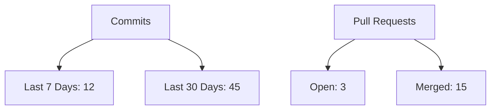

# Novix Project Dashboard

## 📈 Activity Metrics

## 🧑💻 Contributors

Contributors

## 📅 Recent Activity

* Latest Commit: [Add dashboard feature](https://github.com/AInovix/novix/commit) - 2 hours ago
* Recent PR: [Fix authentication bug](https://github.com/AInovix/novix/pull) - Merged
* New Issue: [Feature request: Voice integration](https://github.com/AInovix/novix/issues) - Open

## 📦 Deployment Status

| Environment | Status     | Version    | Last Deployed |
| ----------- | ---------- | ---------- | ------------- |
| Production  | 🟢 Live    | v1.2.3     | 2023-12-15    |
| Staging     | 🟡 Testing | v1.2.4-rc1 | 2023-12-14    |
| Development | 🔄 Running | main       | Continuous    |

## 🛠️ System Health

\
Updated: 2025-04-25 08:30 UTC
